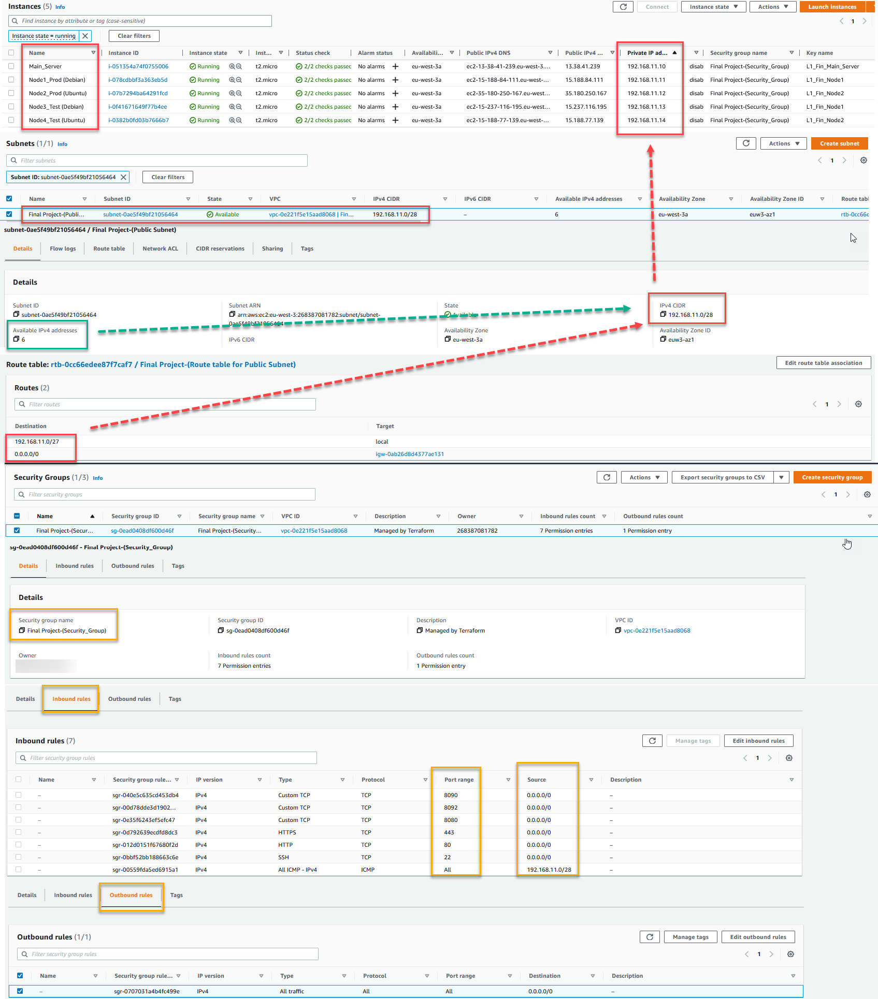

<p align="center">
  
</p>

# 1. Terraform
## 1.1. Preparing
All the necessary information about preparing terraforms for use can be found [here](https://github.com/Ivan2navI/L1_EPAM/tree/main/8.%20Terraform).  

## 1.2. The Terraform configuration for AWS.
The Terraform configuration for AWS will be:  
➢ Creates an Internet Gateway and attaches it to the VPC to allow traffic within the VPC to be reachable by the outside world;  
➢ Creates a public subnet;  
➢ Creates a route table for the public subnet and associates the table with the subnet;  
➢ Creates EC2 instances;  

First we need to create SSH keys in AWS Network & Security:
<p align="center">
  
</p>

and then update it in [variables.tf](https://github.com/Ivan2navI/L1_Epam__Final_project.Private/tree/main/1.Terraform):  

```terraform
# -------------------------  SSH keys  -------------------------------
variable "ec2_ssh_key1" {
    type        = string
    default     = "L1_Fin_Main_Server"
}

variable "ec2_ssh_key2" {
    type        = string
    default     = "L1_Fin_Node1"
}

variable "ec2_ssh_key3" {
    type        = string
    default     = "L1_Fin_Node2"
}
```
EC2 instances will be:
- **Main_Server:** Debian 11 (HVM), SSD Volume Type [ami-040dc155c278da35a (64-bit (x86))]  
- **Node1:** Debian 11 (HVM), SSD Volume Type [ami-040dc155c278da35a (64-bit (x86))]
- **Node2:** Ubuntu Server 20.04 LTS (HVM), SSD Volume Type [ami-0a89a7563fc68be84 (64-bit (x86))]

Inbound rules (open) will be configured for:  
`[ "80", "443", "22", "8080", "8090", "8092" ]`.  

Then use terraform for creating couple of instances in Europe (Paris): `eu-west-3`.  
Run in this project folder `[Winows Command Prompt]` with command: 
```terraform
terraform init
terraform plan
terraform apply
```
And got the result:
<p align="center">
  
</p>

# 2. :a:nsible

-   **Main_Server (Control Node): [192.168.11.10]** Debian 11  \
    The Ansible control node is the machine we'll use to connect to and control the Ansible hosts over SSH.  
    Make sure the control node has:
    - A [non-root user](https://www.digitalocean.com/community/tutorials/initial-server-setup-with-debian-11) with sudo privileges.
    - An SSH keypair associated [with this user](https://www.digitalocean.com/community/tutorials/how-to-set-up-ssh-keys-on-debian-11).

-   One or more Ansible Hosts: 
    -   **Node1: [192.168.11.11]** Debian 11  
    -   **Node2: [192.168.11.12]** Ubuntu Server 20.04 LTS  \
    An Ansible host is any machine that your Ansible control node is configured to automate.
  
## 2.1. Installing Ansible
Using public IPv4 address, сonnect to Main_Server via SSH.  
Once you are logged in as root, we’re prepared to [add the new user account](https://www.digitalocean.com/community/tutorials/initial-server-setup-with-debian-11) that we will use to log in from now on.  
`sudo adduser main`  

As root, run this command to add your new user to the sudo group (substitute the highlighted word with your new user):  
`sudo usermod -aG sudo main`

After that, you will need to install some dependencies in your system. You can install the required dependencies using the following command:  
`apt-get install gnupg2 curl wget -y`

By default, the Ansible package is not included in the Debian default repository.  
There are two ways to install Ansible on Debian 11:   
```console
====================================================================================
# !!! For [Debian 11]
====================================================================================
# 1. Check version of Ansible from Default Upstream Repository.
$ apt-cache policy ansible
ansible:
  Installed: (none)
  Candidate: 2.10.7+merged+base+2.10.8+dfsg-1
  Version table:
     2.10.7+merged+base+2.10.8+dfsg-1 500
        500 http://cdn-aws.deb.debian.org/debian bullseye/main amd64 Packages

# And install
$ sudo apt update
$ sudo apt install ansible
====
+OR+
====
# 2. Install Ansible on Debian 11 from Ubuntu APT Repository.
sudo nano /etc/apt/sources.list

# In the file, add the below line
deb http://ppa.launchpad.net/ansible/ansible/ubuntu bionic main

# The add the Ansible GPG key to your Debian 11 system as below.
sudo apt-key adv --keyserver keyserver.ubuntu.com --recv-keys 93C4A3FD7BB9C367

# Now update your APT package index and install Ansible as below.
sudo apt-get update
sudo apt-get install ansible -y

```
[Example](https://github.com/Ivan2navI/L1_EPAM/blob/main/10.%20Ansible/README.md#21-installing-ansible) of installation on Ubuntu 22.04.1 LTS.  

## 2.2. Setting Up the Inventory File
Copy SSH-keys to **Main_Server [192.168.11.10]**.  

Get a real hostnames of the instances use:
```console
main@ip-192-168-11-10:~$ hostname
> ip-192-168-11-10
```

The inventory file contains all information about the hosts that you will manage with Ansible.
So, create it:
```console
main@ip-192-168-11-10:~$  mkdir ansible
main@ip-192-168-11-10:~$  nano ansible/hosts.txt
# !!! hosts.txt !!!
[staging_servers]
ip-192-168-11-11    ansible_hosts=192.168.11.11 ansible_user=admin ansible_ssh_private_key_file=/home/main/.ssh/L1_Fin_Node1.pem
ip-192-168-11-12    ansible_hosts=192.168.11.12 ansible_user=ubuntu ansible_ssh_private_key_file=/home/main/.ssh/L1_Fin_Node2.pem
```
Add `chmod 400` for all `*.pem` keys and sudo `chown -R main:main /.ssh` and to `*.pem` keys:
```console
ubuntu@ip-192-168-11-10:~/.ssh$   chmod 400 L1_Fin_Node1.pem L1_Fin_Node2.pem

ubuntu@ip-192-168-11-10:~/.ssh$   ssh admin@192.168.11.11 -i ~/.ssh/L1_Fin_Node1.pem

ubuntu@ip-192-168-11-10:~/.ssh$   ssh ubuntu@192.168.11.12 -i ~/.ssh/L1_Fin_Node2.pem
```
And then try command `ansible -i hosts.txt all -m ping`
```console
main@ip-192-168-11-10:~/ansible$ ansible -i hosts.txt all -m ping
ip-192-168-11-11 | SUCCESS => {
    "ansible_facts": {
        "discovered_interpreter_python": "/usr/bin/python3"
    },
    "changed": false,
    "ping": "pong"
}
ip-192-168-11-12 | SUCCESS => {
    "ansible_facts": {
        "discovered_interpreter_python": "/usr/bin/python3"
    },
    "changed": false,
    "ping": "pong"
}
```
**Ansible Configuration File**
Ansible uses the configuration file to load the parameters that are required to run the ansible task. If you have installed ansible using the package manager, you will have an `ansible.cfg` file in `/etc/ansible` directory.  
But, I have created a custom project directory and created a `ansible.cfg` file.  
My config file contains only two properties (inventory location, and disabled host key checking):
```console
ubuntu@ip-192-168-11-10:~/ansible$  nano ansible.cfg
##############################
# !!! ansible.cfg !!!
[defaults]
host_key_checking = false
inventory = ./hosts.txt
##############################

# Now ansible -i hosts.txt all -m ping, can use without -i hosts.txt
ubuntu@ip-192-168-11-10:~/ansible$  ansible all -m ping

## 2.3. Installing Jenkins Using Ansible Playbook

curl https://raw.githubusercontent.com/OpsTree/AnsiblePOC/alok/scripts/Setup/setup_ansible.sh | sudo bash