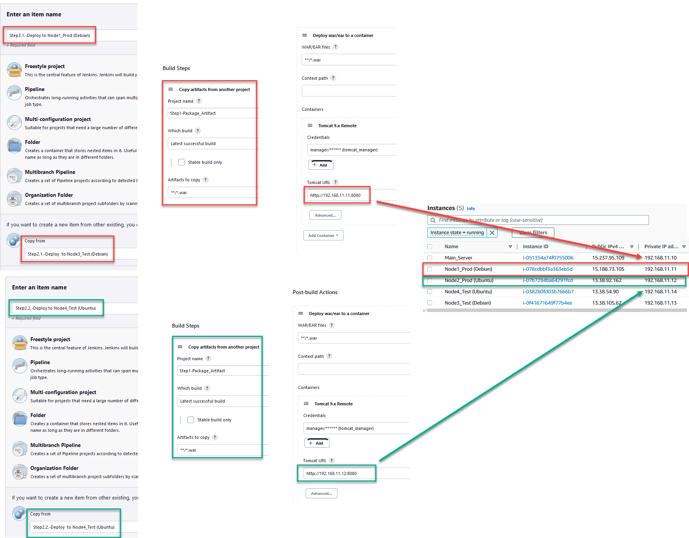

# LINKS:
- Tomcat:
  - [Node1_DebianProd-Tomcat](http://gg.gg/Node1_DebianProd-Tomcat)
  - [Node2_UbuntuProd-Tomcat](http://gg.gg/Node2_UbuntuProd-Tomcat)
  - [Node3_DebianTEST-Tomcat](http://gg.gg/Node3_DebianTEST-Tomcat)
  - [Node4_UbuntuTEST-Tomcat](http://gg.gg/Node4_UbuntuTEST-Tomcat)

- Jenkins:
  -  [JenkinsMainServer.myddns.me:8080](http://jenkinsmainserver.myddns.me:8080)

<p align="center">
  
</p>

# 1. [Terraform](https://github.com/Ivan2navI/L1_EPAM/tree/main/1.%20Final%20project/1.Terraform)  

## 1.1. Preparing

All the necessary information about preparing terraforms for use can be found [here](https://github.com/Ivan2navI/L1_EPAM/tree/main/8.%20Terraform).  

## 1.2. The Terraform configuration for AWS

The Terraform configuration for AWS will be:  
➢ Creates an Internet Gateway and attaches it to the VPC to allow traffic within the VPC to be reachable by the outside world;  
➢ Creates a public subnet;  
➢ Creates a route table for the public subnet and associates the table with the subnet;  
➢ Creates EC2 instances;  

First we need to create SSH keys in AWS Network & Security:
<p align="center">
  
</p>

and then update it in [variables.tf](https://github.com/Ivan2navI/L1_Epam__Final_project.Private/tree/main/1.Terraform):  

```terraform
# -------------------------  SSH keys  -------------------------------
variable "ec2_ssh_key1" {
    type        = string
    default     = "L1_Fin_Main_Server"
}

variable "ec2_ssh_key2" {
    type        = string
    default     = "L1_Fin_Node1"
}

variable "ec2_ssh_key3" {
    type        = string
    default     = "L1_Fin_Node2"
}
```

EC2 instances will be:

- **Main_Server:** Debian 11 (HVM), SSD Volume Type [ami-040dc155c278da35a (64-bit (x86))]  
- **Node1:** Debian 11 (HVM), SSD Volume Type [ami-040dc155c278da35a (64-bit (x86))]
- **Node2:** Ubuntu Server 20.04 LTS (HVM), SSD Volume Type [ami-0a89a7563fc68be84 (64-bit (x86))]

Inbound rules (open) will be configured for:  
`[ "80", "443", "22", "8080", "8090", "8092" ]`.  

Then use terraform for creating couple of instances in Europe (Paris): `eu-west-3`.  
Run in this project folder `[Winows Command Prompt]` with command:

```terraform
terraform init
terraform plan
terraform apply
```

And got the result:
<p align="center">
  
</p>


# 2. [:a:nsible](https://github.com/Ivan2navI/L1_EPAM/tree/main/1.%20Final%20project/2.Ansible)  
- [How to Install and Use Ansible on Debian 11](https://www.howtoforge.com/how-to-install-and-use-ansible-on-debian-11/)
- **Main_Server (Control Node): [192.168.11.10]** Debian 11  \
    The Ansible control node is the machine we'll use to connect to and control the Ansible hosts over SSH.  
    Make sure the control node has:
  - A [non-root user](https://www.digitalocean.com/community/tutorials/initial-server-setup-with-debian-11) with sudo privileges.
  - An SSH keypair associated [with this user](https://www.digitalocean.com/community/tutorials/how-to-set-up-ssh-keys-on-debian-11).

- One or more Ansible Hosts:
  - **Node1/3: [192.168.11.11]** Debian 11  
  - **Node2/4: [192.168.11.12]** Ubuntu Server 20.04 LTS  \
    An Ansible host is any machine that your Ansible control node is configured to automate.
  
## [2.1. Installing Ansible (bash)](https://github.com/Ivan2navI/L1_EPAM/blob/main/1.%20Final%20project/2.Ansible/Install_Ansible.sh)  
Using public IPv4 address, сonnect to Main_Server via SSH.  
Once you are logged in as root, we’re prepared to [add the new user account](https://www.digitalocean.com/community/tutorials/initial-server-setup-with-debian-11) that we will use to log in from now on.  
`sudo adduser main`  

As root, run this command to add your new user to the sudo group (substitute the highlighted word with your new user):  
`sudo usermod -aG sudo main`

After that, you will need to install some dependencies in your system. You can install the required dependencies using the following command:  
`sudo apt-get install gpgv curl wget -y`

By default, the Ansible package is not included in the Debian default repository.  
There are two ways to install Ansible on Debian 11:

```console
====================================================================================
# !!! For [Debian 11]
====================================================================================
# 1. Check version of Ansible from Default Upstream Repository.
sudo apt update
apt-cache policy ansible
#	ansible:
	  Installed: (none)
	  Candidate: 2.10.7+merged+base+2.10.8+dfsg-1
	  Version table:
		 2.10.7+merged+base+2.10.8+dfsg-1 500
			500 http://cdn-aws.deb.debian.org/debian bullseye/main amd64 Packages

# And install
sudo apt update
sudo apt install ansible
====
+OR+
====
# 2. Install Ansible on Debian 11 from Ubuntu APT Repository.
sudo nano /etc/apt/sources.list

# In the file, add the below line
deb http://ppa.launchpad.net/ansible/ansible/ubuntu bionic main

# The add the Ansible GPG key to your Debian 11 system as below.
sudo apt-key adv --keyserver keyserver.ubuntu.com --recv-keys 93C4A3FD7BB9C367

# Now update your APT package index and install Ansible as below.
sudo apt-get update
sudo apt-get install ansible -y

```

[Example](https://github.com/Ivan2navI/L1_EPAM/blob/main/10.%20Ansible/README.md#21-installing-ansible) of installation on Ubuntu 22.04.1 LTS.  

## 2.2. Setting Up the Inventory File

Copy SSH-keys to **Main_Server [192.168.11.10]**.  

Get a real hostnames of the instances use:

```console
main@ip-192-168-11-10:~$ hostname
> ip-192-168-11-10
```

The inventory file contains all information about the hosts that you will manage with Ansible.
So, create it:

```console
main@ip-192-168-11-10:~$  mkdir ansible
main@ip-192-168-11-10:~$  nano ansible/hosts.txt

# !!! hosts!!!

[Node1]
ip-192-168-11-11    ansible_hosts=192.168.11.11 ansible_user=admin ansible_ssh_private_key_file=/home/admin/.ssh/L1_Fin_Node1.pem

[Node2]
ip-192-168-11-12    ansible_hosts=192.168.11.12 ansible_user=ubuntu ansible_ssh_private_key_file=/home/admin/.ssh/L1_Fin_Node2.pem

[Node3]
ip-192-168-11-13    ansible_hosts=192.168.11.13 ansible_user=admin ansible_ssh_private_key_file=/home/admin/.ssh/L1_Fin_Node1.pem

[Node4]
ip-192-168-11-14    ansible_hosts=192.168.11.14 ansible_user=ubuntu ansible_ssh_private_key_file=/home/admin/.ssh/L1_Fin_Node2.pem

[prod:children]
Node1
Node2

[staging:children]
Node3
Node4

[debian:children]
Node1
Node3

[ubuntu:children]
Node2
Node4
```

Add `chmod 400` for all `*.pem` keys and sudo `chown -R main:main /.ssh` and to `*.pem` keys:

```console
ubuntu@ip-192-168-11-10:~/.ssh$   chmod 400 *.pem

ubuntu@ip-192-168-11-10:~/.ssh$   ssh admin@192.168.11.11 -i ~/.ssh/L1_Fin_Node1.pem
ubuntu@ip-192-168-11-10:~/.ssh$   ssh ubuntu@192.168.11.12 -i ~/.ssh/L1_Fin_Node2.pem
ubuntu@ip-192-168-11-10:~/.ssh$   ssh admin@192.168.11.13 -i ~/.ssh/L1_Fin_Node1.pem
ubuntu@ip-192-168-11-10:~/.ssh$   ssh ubuntu@192.168.11.14 -i ~/.ssh/L1_Fin_Node2.pem
```

And then try command `ansible -i hosts.txt all -m ping`

```console
ansible -i hosts all -m ping
ip-192-168-11-11 | SUCCESS => {
    "ansible_facts": {
        "discovered_interpreter_python": "/usr/bin/python3"
    },
    "changed": false,
    "ping": "pong"
}
ip-192-168-11-13 | SUCCESS => {
    "ansible_facts": {
        "discovered_interpreter_python": "/usr/bin/python3"
    },
    "changed": false,
    "ping": "pong"
}
ip-192-168-11-12 | SUCCESS => {
    "ansible_facts": {
        "discovered_interpreter_python": "/usr/bin/python3"
    },
    "changed": false,
    "ping": "pong"
}
ip-192-168-11-14 | SUCCESS => {
    "ansible_facts": {
        "discovered_interpreter_python": "/usr/bin/python3"
    },
    "changed": false,
    "ping": "pong"
}
```

**Ansible Configuration File**
Ansible uses the configuration file to load the parameters that are required to run the ansible task. If you have installed ansible using the package manager, you will have an `ansible.cfg` file in `/etc/ansible` directory.  
But, I have created a custom project directory and created a `ansible.cfg` file.  
My config file contains only two properties (inventory location, and disabled host key checking):

```console
ubuntu@ip-192-168-11-10:~/ansible$  nano ansible.cfg
##############################
# !!! ansible.cfg !!!
[defaults]
host_key_checking = false
inventory = ./hosts.txt
##############################

# Now ansible -i hosts.txt all -m ping, can use without -i hosts.txt
ubuntu@ip-192-168-11-10:~/ansible$  ansible all -m ping
```

## 2.3. [Install Tomcat (.yml)](https://github.com/Ivan2navI/L1_EPAM/tree/main/1.%20Final%20project/2.Ansible/ansible/my-tomcat-ansible) 
- [GIT: jmutai / tomcat-ansible (2019)](https://github.com/jmutai/tomcat-ansible)

Primaly in `tomcat-ansible` add & modify:  
```bash
nano ansible.cfg

##############################
# !!! ansible.cfg !!!
[defaults]
host_key_checking = false
inventory = ../hosts
##############################
```

Update variables in playbook file - Set Tomcat version, remote user and Tomcat UI access credentials:  
<p align="center">
  
</p>

In this file `tomcat-ansible\roles\tomcat\defaults\main.yml` update version for `tomcat-10`:  
```yml
tomcat_archive_url: https://archive.apache.org/dist/tomcat/tomcat-10/v{{ tomcat_ver }}/bin/apache-tomcat-{{ tomcat_ver }}.tar.gz
tomcat_archive_dest: /tmp/apache-tomcat-{{ tomcat_ver }}.tar.gz
```

In this file `\tomcat-ansible\roles\tomcat\templates\tomcat-users.xml.j2` add parameter `manager-script`,  
it will be help to load code into **Tomcat WebApp** from **Jenkins**:  
```xml
<role rolename="manager-gui" />
<user username="{{ ui_manager_user }}" password="{{ ui_manager_pass }}" roles="manager-gui,manager-script" />

<!-- user admin can access manager and admin section both -->
<role rolename="admin-gui" />
<user username="{{ ui_admin_username }}" password="{{ ui_admin_pass }}" roles="manager-gui,admin-gui,manager-script" />
</tomcat-users>
```

Once all values are updated, you can then run the playbook:  
`ansible-playbook tomcat-setup.yml`

## 2.4. [Install MySQL (.yml)](https://github.com/Ivan2navI/L1_EPAM/tree/main/1.%20Final%20project/2.Ansible/ansible/my-mysql-ansible)
- [Automated MySQL Server Preparation Using Ansible (2020)](https://www.continuent.com/resources/blog/automated-mysql-server-preparation-using-ansible)
- [Using Ansible to Install and Initialize Mysql 8 on Rocky Linux/Centos 8 (2021)](https://citizix.com/using-ansible-to-install-and-initialize-mysql-8-on-centos-8/)
- [Install MySQL with ansible on ubuntu (2015)](https://stackoverflow.com/questions/26597926/install-mysql-with-ansible-on-ubuntu)
- [Automate MySQL 8.0 Installation with Ansible (2019)](https://mydbops.wordpress.com/2019/01/25/automate-mysql-8-0-installation-with-ansible/)
- [Automate a MySQL Install and Database (2022)](https://www.theurbanpenguin.com/automate-a-mysql-install-and-database/)
- [Existing Ansible Modules and Roles for MariaDB](https://mariadb.com/kb/en/existing-ansible-modules-and-roles-for-mariadb/)
- [Ansible - MYSQL installation (2020)](https://medium.com/@kelom.x/ansible-mysql-installation-2513d0f70faf)

- [GIT: kelom-x / ansible-install-mysql (2020)](https://github.com/kelom-x/ansible-install-mysql)
- [GIT:  idealista / mysql_role](https://github.com/idealista/mysql_role)
- [!!! GIT:  geerlingguy / ansible-role-mysql {~2023}](https://github.com/geerlingguy/ansible-role-mysql)
- [!!! GITLAB: ansible-role-mysql](https://gitlab.com/lean-delivery/ansible-role-mysql)
- [Install MySQL Database Server through Ansible Playbook](https://www.techtransit.org/install-mysql-database-server-through-ansible-playbook/)
- [How to Run Remote Commands with Ansible Shell Module](https://www.cherryservers.com/blog/how-to-run-remote-commands-with-ansible-shell-module)
  
Ansible-galaxy is a public role library of ansible code written by community users and administrators. Galaxy contains lots of ansible roles, you can search for any role on ansible galaxy official website https://galaxy.ansible.com. We will [import the MySQL role into our main playbook](https://galaxy.ansible.com/geerlingguy/mysql) and pass the MySQL variable in our playbook.

Above command will download the role of mysql inside the roles directory. Roles directory is inside the project directory. You can see my directory structure. 
```console
ansible-galaxy install geerlingguy.mysql  -p roles
Starting galaxy role install process
- downloading role 'mysql', owned by geerlingguy
- downloading role from https://github.com/geerlingguy/ansible-role-mysql/archive/4.3.0.tar.gz
- extracting geerlingguy.mysql to /home/admin/roles/geerlingguy.mysql
- geerlingguy.mysql (4.3.0) was installed successfully
```

Check:
```console
/ansible/mysql-ansible$ ansible-galaxy list
# /home/admin/roles
- geerlingguy.mysql, 4.3.0
```

Primaly in `my-mysql-ansible` add & modify:  
```bash
nano ansible.cfg

##############################
# !!! ansible.cfg !!!
host_key_checking = false
inventory = ../hosts
#ask_pass=false
roles_path=/home/admin/roles
##############################
```

After that we create the vars folder inside the project directory and pass it like root password , the database you want to create, and user and give privilege through the variable.  
As an [example](https://gitlab.com/lean-delivery/ansible-role-mysql)   

```yml
# Installing MySQL 8.0 version:

- hosts: db-servers
  roles:
    - role: lean_delivery.mysql
  vars:
    mysql_root_password: 88TEM-veDRE<888serd
    mysql_databases:
      - name: example2_db
        encoding: latin1
        collation: latin1_general_ci
    mysql_users:
      - name: example2_user
        host: "%"
        password: Sime32-SRRR-password
        priv: "example2_db.*:ALL"
    mysql_port: 3306
    mysql_bind_address: '0.0.0.0'
    mysql_daemon: mysqld
    mysql_version: 8.0
    mysql_packages:
      - mysql-server
```
So, created `mysql.yml` main playbook, which will import roles and vars and run into the managed host:  
```yml
# Installing in MySQL - database `trackizer`:
---
- hosts: db_servers
  roles:
    - role: geerlingguy.mysql
      become: yes	
  vars:
    mysql_root_password: root
    mysql_databases:
      - name: trackizer
    mysql_users:
      - name: root
#        host: "localhost"
        password: root
        priv: "*.*:ALL"
```

Login into to MySQL (as an example on Node2) and checking :
```sql
mysql> SHOW GRANTS for root@localhost;
+-----------------------------------------------------------------------------------------------------------------------------------------------------------+
| Grants for root@localhost                                                                                                                                	|
+-----------------------------------------------------------------------------------------------------------------------------------------------------------+
| GRANT SELECT, INSERT, UPDATE, DELETE, CREATE, DROP, RELOAD, SHUTDOWN, PROCESS, FILE, REFERENCES, INDEX, ALTER, SHOW DATABASES, SUPER, 					|
| CREATE TEMPORARY TABLES, LOCK TABLES, EXECUTE, REPLICATION SLAVE, REPLICATION CLIENT, CREATE VIEW, SHOW VIEW, CREATE ROUTINE, ALTER ROUTINE, CREATE USER, |
| EVENT, TRIGGER, CREATE TABLESPACE, CREATE ROLE, DROP ROLE ON *.* TO `root`@`localhost` 																	|
| GRANT PROXY ON ``@`` TO `root`@`localhost` WITH GRANT OPTION																								|
+-----------------------------------------------------------------------------------------------------------------------------------------------------------+
2 rows in set (0.00 sec)
```

## 2.5. [Add data (trackizer database) to MySQL (.yml)](https://github.com/Ivan2navI/L1_EPAM/tree/main/1.%20Final%20project/2.Ansible/ansible/mysql-ansible-insertDB) 
- [How to Run Remote Commands with Ansible Shell Module](https://www.cherryservers.com/blog/how-to-run-remote-commands-with-ansible-shell-module)  
- [Insert data into mysql tables using ansible](https://stackoverflow.com/questions/28188508/insert-data-into-mysql-tables-using-ansible)  
- [mysql_db – Add or remove MySQL databases from a remote host](https://docs.ansible.com/ansible/2.9_ja/modules/mysql_db_module.html)  
  
Primaly in `mysql-ansible-insertDB` add & modify:  
```bash
nano ansible.cfg
##############################
# !!! ansible.cfg !!!
[defaults]
host_key_checking = false
inventory = ../hosts
command_warnings=False
#ask_pass=false
##############################
```
Created `mysql_insertDB.yml` main playbook:
```yml
---
- name: Install DB into MySQL server 
  hosts: db_servers             # Inventory hosts group / server to act on
  become: yes               # If to escalate privilege
  #remote_user: root     # user on remote hosts
  become: yes           # enable root privileges
  #gather_facts: yes     # collect useful variables about remote hosts
  
  tasks:

  - name: cd HOME
    shell: "cd $HOME"
  
  - name: mkdir trackizer_DB   
    shell: "mkdir trackizer_DB"

  # Download DB source file to HOME/trackizer_DB
  - name: Download DB source file to HOME/trackizer_DB
    shell: wget https://raw.githubusercontent.com/Ivan2navI/L1_EPAM/main/1.%20Final%20project/.db/text_database_v2
    args:
      chdir: ./trackizer_DB
      warn: false
  
#  - name: Copy DB from Git 
#    shell: "wget https://raw.githubusercontent.com/Ivan2navI/L1_EPAM/main/1.%20Final%20project/.db/text_database_v2 -P ./trackizer_DB"

  - name: Import DB
    shell: mysql -uroot -proot < ./trackizer_DB/text_database_v2

  - name: REMOVE trackizer_DB   
    shell: "rm -r trackizer_DB/"
```

# 3. [Install & Configure NoIP](https://thanoskoutr.com/posts/noip2-install-and-service-commands/)  

No-IP is a Free Dynamic DNS and Managed DNS Provider, that we can use to get a free domain name. There a lot of free Dynamic DNS services, you can find a good comprehensive of them here that we can choose from, but this was the first service that I personally tried.

The good with this service is that we have a big selection of free domain names that we can choose, so we can easily find a domain that is available for the hostname we want to have.

The negative is that every 30 days they send a notification email, and we have to sign in to www.NoIP.com and confirm that we still use the hostname. After some time that I have used the service, I can say that it becomes annoying to verify it once every month.

**[In our case No-IP](https://github.com/Ivan2navI/L1_EPAM/blob/main/1.%20Final%20project/3.Jenkins/3.%20Install%20%26%20Configure%20NoIP.txt)** will update Dynamic DNS to AWS public IP adress for Main Server & Jenkins (http://jenkinsmainserver.myddns.me:8080/).

And got the result:
<p align="center">
  
</p>


# 4. [Install Git (bash)](https://github.com/Ivan2navI/L1_EPAM/blob/main/1.%20Final%20project/3.Jenkins/Install_Git.sh)  

First, use the apt package management tools to update your local package index.  
`sudo apt update`

With the update complete, you can install Git:  
`sudo apt install git`

You can confirm that you have installed Git correctly by running the following command and checking that you receive relevant output.  
`git --version`

**Setting Up Git**

After you are satisfied with your Git version, you should configure Git so that the generated commit messages you make will contain your correct information and support you as you build your software project.  

Configuration can be achieved by using the git config command. Specifically, we need to provide our name and email address because Git embeds this information into each commit we do. We can go ahead and add this information by typing:  

```console
    git config --global user.name "Your Name"
    git config --global user.email "youremail@domain.com"
```

We can display all of the configuration items that have been set by typing:  

```console
git config --list

# Output
user.name=Your Name
user.email=youremail@domain.com
```


# 5. [Jenkins](https://github.com/Ivan2navI/L1_EPAM/tree/main/1.%20Final%20project/3.Jenkins)  

**More info [link](https://github.com/Ivan2navI/L1_EPAM/tree/main/7.%20Jenkins).**

## 5.1. [Install OpenJDK 11 (bash)](https://github.com/Ivan2navI/L1_EPAM/blob/main/1.%20Final%20project/3.Jenkins/Install_Java.sh) 

The Jenkins project performs a full test flow with the following JDK/JREs:
- OpenJDK JDK / JRE 11 - 64 bits
- OpenJDK JDK / JRE 17 - 64 bits

```bash
sudo apt update && sudo apt upgrade -y

apt-cache search openjdk

sudo apt-get install openjdk-11-jdk -y

java --version
$JAVA_HOME/bin/java --version
echo $JAVA_HOME

echo "JAVA_HOME=/usr/lib/jvm/java-11-openjdk-amd64" | sudo tee -a /etc/environment
=> JAVA_HOME=/usr/lib/jvm/java-11-openjdk-amd64
source /etc/environment

echo $JAVA_HOME
=> JAVA_HOME=/usr/lib/jvm/java-11-openjdk-amd64

# Updates are handled with the standard apt update and upgrade commands. 
# However, you can remove them separately or altogether if you no longer require JDK or JRE.

Example:
sudo apt-get autoremove openjdk-11-jdk --purge -y
```

## 5.2. [Installing Jenkins (bash)](https://github.com/Ivan2navI/L1_EPAM/blob/main/1.%20Final%20project/3.Jenkins/Install_Jenkins.sh)

On Debian and Debian-based distributions like Ubuntu you can install Jenkins through apt.  
A LTS (Long-Term Support) release is chosen every 12 weeks from the stream of regular releases as the stable release for that time period. It can be installed from the debian-stable apt repository.  

```console
curl -fsSL https://pkg.jenkins.io/debian/jenkins.io.key | sudo tee \
  /usr/share/keyrings/jenkins-keyring.asc > /dev/null
echo deb [signed-by=/usr/share/keyrings/jenkins-keyring.asc] \
  https://pkg.jenkins.io/debian binary/ | sudo tee \
  /etc/apt/sources.list.d/jenkins.list > /dev/null

sudo apt-get update
sudo apt-get install jenkins
```

__Start Jenkins__  
You can enable the Jenkins service to start at boot with the command:
`sudo systemctl enable jenkins`

You can start the Jenkins service with the command:
`sudo systemctl start jenkins`

You can check the status of the Jenkins service using the command:
`sudo systemctl status jenkins`

__Unlocking Jenkins__  
Browse to <http://localhost:8080> (or whichever port you configured for Jenkins when installing it) and wait until the Unlock Jenkins page appears.

```
sudo cat /var/lib/jenkins/secrets/initialAdminPassword 
==> a6bfxxxxxx7d0a84bca880xxxxxxxxxxxx
```
Register Jenkins and then **[change](https://github.com/Ivan2navI/L1_EPAM/tree/main/7.%20Jenkins#2-installing-jenkins)** a language of the web-interface to ENGLISH.  

## 5.3. Intall & configure plugins (JDK, Git & Maven).
Use next steps to configure JDK, Git & Maven:  

<p align="center">
  
</p>

## 5.4. Deploy from Git over SSH
<p align="center">
  
</p>


**[Open Jenkins MAIN Server terminal login under Jenkins](https://stackoverflow.com/questions/15174194/jenkins-host-key-verification-failed)**:  
`sudo su jenkins`  

In the directory `.ssh` generate public private key:

```console
sudo su jenkins

cd /var/lib/jenkins/
mkdir .ssh
cd .ssh

ssh-keygen

# Generating public/private rsa key pair.
# Enter file in which to save the key (/var/lib/jenkins/.ssh/id_rsa): AWS_Jenkins
# Enter passphrase (empty for no passphrase):
# Enter same passphrase again:
# Your identification has been saved in AWS_Jenkins
# Your public key has been saved in AWS_Jenkins.pub
# The key fingerprint is:
# SHA256:MZrwuWHTFGnZsfroHS1YaHniU4/s
# The key's randomart image is:
# +---[RSA 3072]----+
# |        .+..     |
# |      `o +...    |
# |    .. ++ .      |
# |     *oo* *      |
# |     .0O.S o     |
# |    o.B* O .     |
# |   od X.==.+ .   |
# |    * *oE. o     |
# |     =oo.. .     |
# +----[SHA256]-----+
```
__!!! Add github.com to the known hosts !!!__  

```console
jenkins@jenkins:~/.ssh$ ssh-keyscan github.com >> /var/lib/jenkins/.ssh/known_hosts

# github.com:22 SSH-2.0-babeld-9635f69e
# github.com:22 SSH-2.0-babeld-9635f69e
# github.com:22 SSH-2.0-babeld-9635f69e
# github.com:22 SSH-2.0-babeld-9635f69e
# github.com:22 SSH-2.0-babeld-9635f69e
```

Add public key to GitHub repository:
<p align="center">
  
</p>

Add credentials (Username, ID + Description, Private Key) to project.

<p align="center">
  
</p>


# 6. [Maven project](https://github.com/Ivan2navI/Maven_Project_Trackizer)

## 6.1. Delivering: :briefcase: GitHub :arrow_right: Jenkins (Maven) :arrow_right: Tomcat (STAGING) :ok:  
First, let's check the functionality of Jenkins for delivering an artifact to Tomcat's servers (192.168.11.[11-14])

For this, we will install two plugins:

- __Copy Artifact:__ This plugin allows Jenkins to copy an artifact that was created by another job.
- __Deploy to container:__ This plugin allows to deploy a war artifact to a container (Tomcat) after a successful build.  
<p align="center">
  
</p>

Then create jenkin's free style project **Step1-Package_Artifact** with such settings (below).
And add the __"Archive the artifact"__ item to the __"Post-build Actions"__,  
as a result of which Jenkins will pack all the files with the extension __"**/*.war"__ into one common file.  
Then add __"Post-build Actions -> Build other projects"__ and select project `Step2.x-Deploy_to_staging (Node_TEST)`, then __"Save & Build Now"__.  
<p align="center">
  
</p>

Next, create new pipeline **Step2.x-Deploy_to_staging (Node_TEST)**.  
This job in section __Build Steps__ copies any artifact (**/*.war) from `Step1-Package_Artifact`. 
Then it must deploy to Tomcat Servers (<http://External_IP:8080/javaproject/>) with credential of __manager__ user.  

<p align="center">
  
</p>

The result of deploying the application for STAGING will look like this:  
<p align="center">
  
</p>

To visualize the relationships between jobs, install the plugin **Build Pipeline**.  
<p align="center">
  
</p>

## 6.2. Delivering: :briefcase: Tomcat (STAGING) :arrow_right: Tomcat (PRODUCTION) :ok:  
Create a new job `Step3.x-Deploy_to_Prod (Node_Prod)` as a copy of `Step2.x-Deploy_to_staging (Node_TEST)`.  
Then change a derscription and Tomcat Servers Production IP (<http://External_IP:8080/javaproject/>). 
<p align="center">
  
</p>

After that go to `Step2.x-Deploy_to_staging (Node_TEST)`, and add  __"Post-build Actions -> Build other projects (manual step)"__, that means a `Step3.x-Deploy_to_Prod (Node_Prod)` will be begin only after the manual accepting.
<p align="center">
  
</p>

## 6.3. Code Quality и Code Coverage Metrics Report. Gradle, Ant in Jenkins.

**Java Build Tool Overview:**
- ***Maven:*** is a powerful software project management tool used in the Java development environment to manage and build projects as well as to maintain dependencies. Maven uses an XML (pom.xml) for project configuration. Nonetheless, the learning curve for Maven isn’t terrible and after a couple hours of reading in parallel with writing your build script, you’ll do enough trial and error to get started.

- ***Gradle:*** is a modern automation tool used in software development for project build automation. Gradle has its own domain-specific language (DSL) based on a Groovy (build.gradle) or Kotlin (build.gradle.kts) code.

- ***Ant:*** is the predecessor of Apache Maven. First released in 2000, Ant was developed as a replacement for a build tool Make, which was used widely in software development in the past. Using an XML file, Ant is used to automatize build tasks. But, without the addition of the Apache Ivy plugin, Ant doesn’t support dependency management.  


**[Checkstyle](https://checkstyle.sourceforge.io/index.html)** is a development tool to help programmers write Java code that adheres to a coding standard. It automates the process of checking Java code to spare humans of this boring (but important) task. This makes it ideal for projects that want to enforce a coding standard.  

A **Checkstyle configuration** specifies which *modules* to plug in and apply to Java source files. Modules are structured in a tree whose root is the *Checker* module. The next level of modules contains:  

- *File Set Checks* - modules that take a set of input files and fire violation messages.
- *Filters* - modules that filter audit events, including messages, for acceptance.
- *Audit Listeners* - modules that report accepted events.

All functionality has been integrated into the [Warnings Next Generation Plugin](https://github.com/jenkinsci/warnings-ng-plugin) and the [Static Analysis Model and Parsers Library](https://github.com/jenkinsci/analysis-model).  

<p align="center">
  
</p>

__Check that the Gradle & Ant plugins are installed in Jenkins__
<p align="center">
  
</p>  

The FindBugs, PMD and CheckStyle Jenkins plugins have all been deprecated in favor of the **Warnings Next Generation** static code analysis report generation tool.  
With **Warnings Next Generation** plugin installed, a new post-build option named Record compiler warnings and static analysis results becomes available to all Jenkins build jobs.  It provides a dropdown list from which hundreds of differing static code analysis tools can be chose, including ***CheckStyle, PMD and FindBugs***.

So, download **Warnings Next Generation** plugin. 

Then create a new **Parallel Job** `Code Quality Report` as a copy of `Step1-Package_Artifact`.  
Add to `"Build Steps -> Goals"` such parameters: `checkstyle:checkstyle pmd:pmd findbugs:findbugs`.  
And change `Post-build Actions` like this:  
<p align="center">
  
</p>  

As a result, we get reports for each plugins (FindBugs, PMD and CheckStyle) will be displayed in the status window of the build job:  
<p align="center">
  
</p>   

## 6.4. GitHub Hook trigger for GITScm polling
This feature enables builds after post-receive hooks in your GitHub repositories. This trigger only kicks git-plugin internal polling algo for every incoming event against matched repo.  
The URL in Jenkins that receives the post-commit POSTs: `http://jenkinsmainserver.myddns.me:8080/github-webhook/`.

<p align="center">
  
</p>  

Once that configuration is done, go to the project config of each job you want triggered automatically and simply check "GitHub hook trigger for GITScm polling" under "Build Triggers". With this, every new push to the repository automatically triggers a new build.

Note that there's only one URL and it receives all post-receive POSTs for all your repositories. The server side of this URL is smart enough to figure out which projects need to be triggered, based on the submission.  

Make some change in **[Maven_Project_Trackizer](https://github.com/Ivan2navI/Maven_Project_Trackizer/blob/main/src/main/webapp/index.jsp)** and check results.

<p align="center">
  
</p>  

