# 10. :a:nsible

## 1. Tech Environment for Ansible Project

<p align="center">
  
</p>

### [The Terraform configuration below:](https://github.com/Ivan2navI/L1_EPAM/tree/main/10.%20Ansible/home_task)
➢ Creates an Internet Gateway and attaches it to the VPC to allow traffic within the VPC to be reachable by the outside world;  
➢ Creates a public subnet;  
➢ Creates a route table for the public subnet and associates the table with the subnet;  
➢ Creates EC2 instances;
<p align="center">
  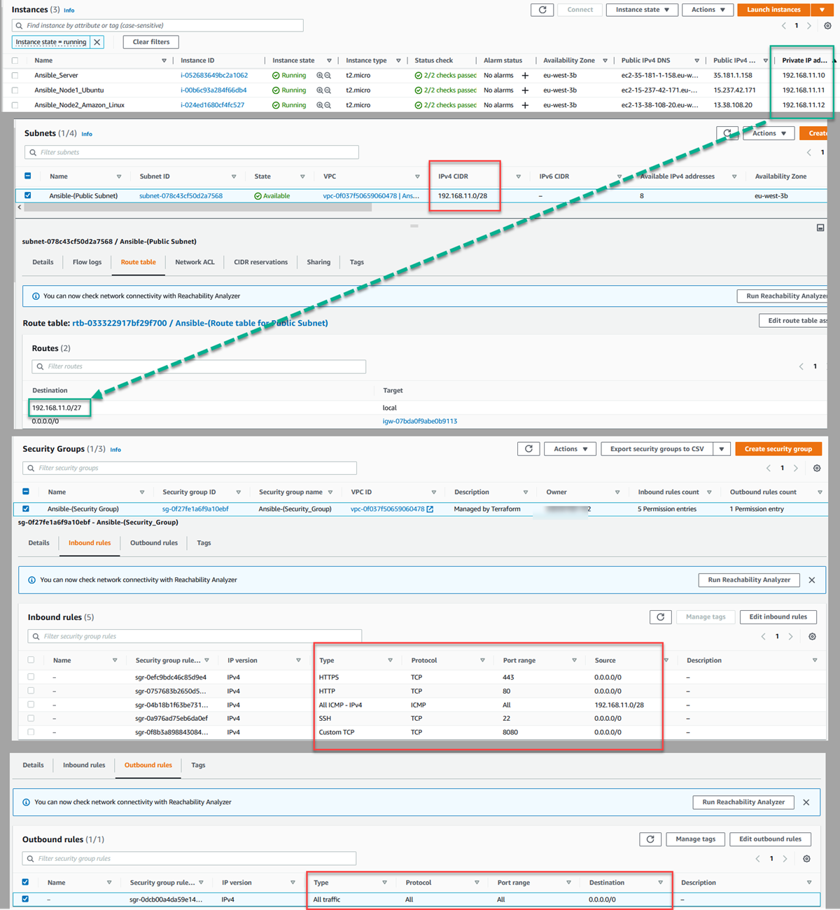
</p>

## [2. Install and Configure :a:nsible on Ubuntu 22.04 & Amazon Linux](https://www.digitalocean.com/community/tutorials/how-to-install-and-configure-ansible-on-ubuntu-22-04)

- **Ansible Server (Control Node): [192.168.11.10]** Ubuntu 22.04.1 LTS  
  The Ansible control node is the machine we’ll use to connect to and control the Ansible hosts over SSH.
- One or more Ansible Hosts:  
  An Ansible host is any machine that your Ansible control node is configured to automate.  
  - **Ansible Node1: [192.168.11.11]** Ubuntu 22.04.1 LTS 
  - **Ansible Node2: [192.168.11.12]** Amazon Linux 2 Kernel 5.10 AMI 2.0.20221210.1 

### 2.1. Installing Ansible
To begin using Ansible as a means of managing your server infrastructure, you need to install the Ansible software on the machine that will serve as the Ansible control node.
From your control node, run the following command to include the official project’s PPA (personal package archive) in your system’s list of sources:
```console
sudo apt-add-repository ppa:ansible/ansible

sudo apt update

sudo apt install ansible

# Check version
ansible --version

ansible [core 2.13.7]
  config file = /etc/ansible/ansible.cfg
  configured module search path = ['/home/ubuntu/.ansible/plugins/modules', '/usr/share/ansible/plugins/modules']
  ansible python module location = /usr/lib/python3/dist-packages/ansible
  ansible collection location = /home/ubuntu/.ansible/collections:/usr/share/ansible/collections
  executable location = /usr/bin/ansible
  python version = 3.10.6 (main, Nov  2 2022, 18:53:38) [GCC 11.3.0]
  jinja version = 3.0.3
  libyaml = True
```
### 2.2. Setting Up the Inventory File
The inventory file contains all information about the hosts that you will manage with Ansible.
So, create it:
```console
ubuntu@ip-192-168-11-10:~$  mkdir ansible
ubuntu@ip-192-168-11-10:~$  nano hosts.txt
# !!! hosts.txt !!!
[staging_servers]
Node1_Ubuntu    ansible_hosts=192.168.11.11 ansible_user=ubuntu ansible_ssh_private_key_file=/home/ubuntu/.ssh/ansible_node1.pem
Node2_Ubuntu    ansible_hosts=192.168.11.12 ansible_user=ec2-user ansible_ssh_private_key_file=/home/ubuntu/.ssh/ansible_node2.pem
```
Add `chmod 400` for all `*.pem` keys:
```console
ubuntu@ip-192-168-11-10:~/.ssh$   chmod 400 ansible_node1.pem ansible_node2.pem

ubuntu@ip-192-168-11-10:~/.ssh$   ssh ubuntu@192.168.11.11 -i ~/.ssh/ansible_node1.pem

ubuntu@ip-192-168-11-10:~/.ssh$   ssh ec2-user@192.168.11.12 -i ~/.ssh/ansible_node2.pem
```
And then try commnd `ansible -i hosts.txt all -m ping`,  
but, it caused an error:
<p align="center">
  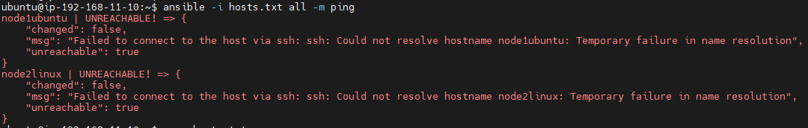
</p>

To get a real hostnames of the instances use:
```console
ubuntu@ip-192-168-11-10:~$ hostname
> ip-192-168-11-10
```
Modify the `hosts.txt`:
```console
# !!! hosts.txt !!!
[staging_servers]
ip-192-168-11-11    ansible_hosts=192.168.11.11 ansible_user=ubuntu ansible_ssh_private_key_file=/home/ubuntu/.ssh/ansible_node1.pem
ip-192-168-11-12    ansible_hosts=192.168.11.12 ansible_user=ec2-user ansible_ssh_private_key_file=/home/ubuntu/.ssh/ansible_node2.pem
```
Check results `ansible -i hosts.txt all -m ping`:
<p align="center">
  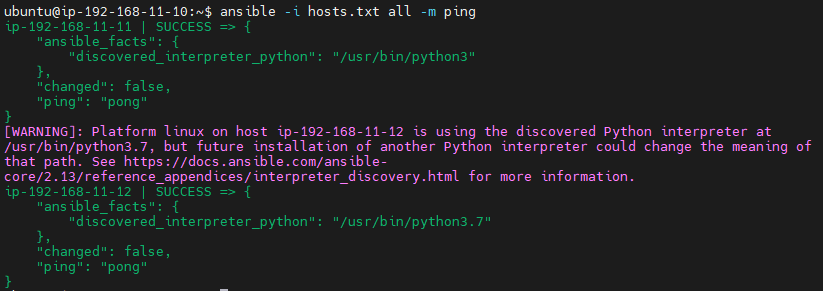
</p>

### [2.3. Ansible Configuration File](https://ostechnix.com/ansible-inventory-and-configuration-files/)
Ansible uses the configuration file to load the parameters that are required to run the ansible task. If you have installed ansible using the package manager, you will have an `ansible.cfg` file in `/etc/ansible` directory.  
But, I have created a custom project directory and created a `ansible.cfg` file.  
My config file contains only two properties (inventory location, and disabled host key checking):
```console
ubuntu@ip-192-168-11-10:~/ansible$  nano ansible.cfg
##############################
# !!! ansible.cfg !!!
[defaults]
host_key_checking = false
inventory = ./hosts.txt
##############################

# Now ansible -i hosts.txt all -m ping, can use without -i hosts.txt
ubuntu@ip-192-168-11-10:~/ansible$  ansible all -m ping
```

### [2.4. Inventory File With Host Vars, Group Vars & Child Groups](https://ostechnix.com/ansible-inventory-and-configuration-files/)
You can create a group and use other group names under it.  
Inventory file supports host & group variables. Host variables are nothing but variables and their values passed to the host in the inventory file.  
Group vars is same as host vars but the variables will be applied to the entire group instead of a single host. So you can create a group var where the variables will be inherited by all the nodes in the group. You need to add :vars to make the group as group vars.
```yml
# !!! hosts.txt !!!
[staging_servers]
ip-192-168-11-11    ansible_hosts=192.168.11.11 ansible_user=ubuntu ansible_ssh_private_key_file=/home/ubuntu/.>

[test]
ip-192-168-11-12    ansible_hosts=192.168.11.12 ansible_user=ec2-user ansible_ssh_private_key_file=/home/ubuntu>

[ubuntu:children]
staging_servers

[linux:children]
test

[test_prod:children]
staging_servers
test

[test_prod:vars]
ansible_python_interpreter=/usr/bin/python3
```
### [2.5. Ansible Inventory Command](https://ostechnix.com/ansible-inventory-and-configuration-files/)
To get the inventory details in the graph format, use `--graph flag`. If you have different inventory files, you can use -i flag to explicitly point to the inventory file.  
```yml
ubuntu@ip-192-168-11-10:~/ansible$ ansible-inventory --graph
@all:
  |--@test_prod:
  |  |--@staging_servers:
  |  |  |--ip-192-168-11-11
  |  |--@test:
  |  |  |--ip-192-168-11-12
  |--@ungrouped:
```
You can print the host and group var information by passing `--vars` flag along with `--graph` flag.
```yml
ubuntu@ip-192-168-11-10:~/ansible$ ansible-inventory --graph --vars
@all:
  |--@test_prod:
  |  |--@staging_servers:
  |  |  |--ip-192-168-11-11
  |  |  |  |--{ansible_hosts = 192.168.11.11}
  |  |  |  |--{ansible_python_interpreter = /usr/bin/python3}
  |  |  |  |--{ansible_ssh_private_key_file = /home/ubuntu/.ssh/ansible_node1.pem}
  |  |  |  |--{ansible_user = ubuntu}
  |  |--@test:
  |  |  |--ip-192-168-11-12
  |  |  |  |--{ansible_hosts = 192.168.11.12}
  |  |  |  |--{ansible_python_interpreter = /usr/bin/python3}
  |  |  |  |--{ansible_ssh_private_key_file = /home/ubuntu/.ssh/ansible_node2.pem}
  |  |  |  |--{ansible_user = ec2-user}
  |  |--{ansible_python_interpreter = /usr/bin/python3}
  |--@ungrouped:
```
When you use the `--list` flag, the output will be in JSON format.
```yml
ubuntu@ip-192-168-11-10:~/ansible$ ansible-inventory --list
{
    "_meta": {
        "hostvars": {
            "ip-192-168-11-11": {
                "ansible_hosts": "192.168.11.11",
                "ansible_python_interpreter": "/usr/bin/python3",
                "ansible_ssh_private_key_file": "/home/ubuntu/.ssh/ansible_node1.pem",
                "ansible_user": "ubuntu"
            },
            "ip-192-168-11-12": {
                "ansible_hosts": "192.168.11.12",
                "ansible_python_interpreter": "/usr/bin/python3",
                "ansible_ssh_private_key_file": "/home/ubuntu/.ssh/ansible_node2.pem",
                "ansible_user": "ec2-user"
            }
        }
    },
    "all": {
        "children": [
            "test_prod",
            "ungrouped"
        ]
    },
    "staging_servers": {
        "hosts": [
            "ip-192-168-11-11"
        ]
    },
    "test": {
        "hosts": [
            "ip-192-168-11-12"
        ]
    },
    "test_prod": {
        "children": [
            "staging_servers",
            "test"
        ]
    }
}
```
`ansible-inventory --list -y` containing your own server infrastructure as defined in your inventory file:
```yml
ubuntu@ip-192-168-11-10:~/ansible$ ansible-inventory --list -y
all:
  children:
    test_prod:
      children:
        staging_servers:
          hosts:
            ip-192-168-11-11:
              ansible_hosts: 192.168.11.11
              ansible_python_interpreter: /usr/bin/python3
              ansible_ssh_private_key_file: /home/ubuntu/.ssh/ansible_node1.pem
              ansible_user: ubuntu
        test:
          hosts:
            ip-192-168-11-12:
              ansible_hosts: 192.168.11.12
              ansible_python_interpreter: /usr/bin/python3
              ansible_ssh_private_key_file: /home/ubuntu/.ssh/ansible_node2.pem
              ansible_user: ec2-user
    ungrouped: {}
```

### [2.6. setup - Gathers facts about remote hosts](https://docs.ansible.com/ansible/2.5/modules/setup_module.html)
This module is automatically called by playbooks to gather useful variables about remote hosts that can be used in playbooks.
<p align="center">
  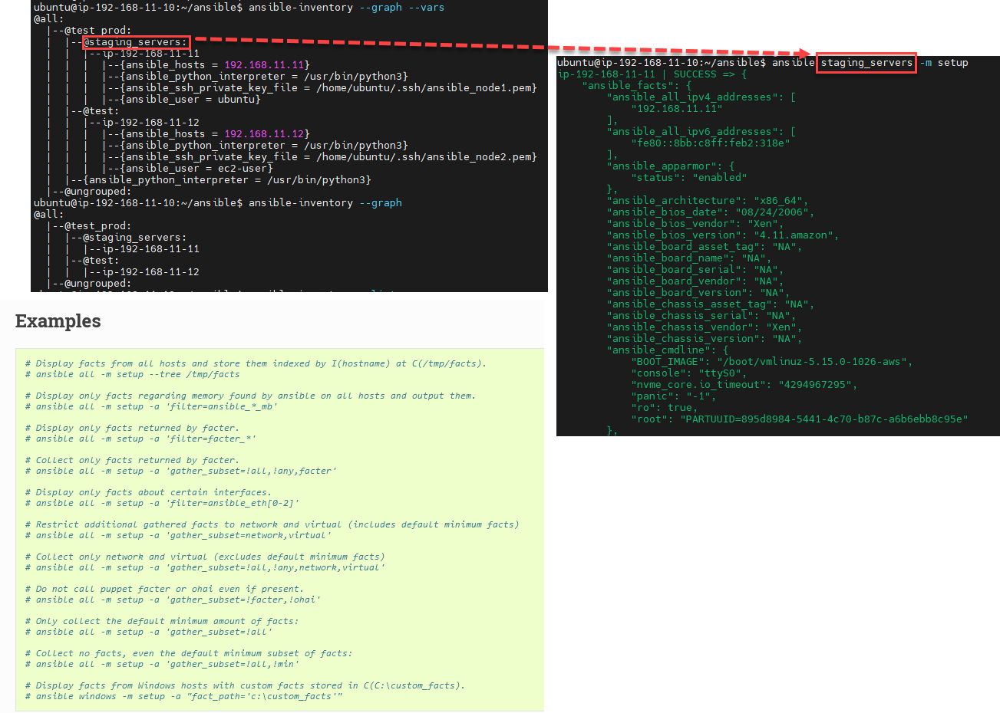
</p>

### [2.7. Ad hoc Command](https://ostechnix.com/ansible-ad-hoc-commands/)
There are a few inputs you have to provide when running the ad hoc command:
- You have to specify the targets(managed nodes). Either you can use the default "all/ungrouped" groups or user-defined groups.
- You have to pass the module name as an argument to the -m flag.
- Every module accepts a set of options. Those options should be passed as arguments to -a flag. If there are multiple options then they should be enclosed within quotes.
```console
$ ansible [group] -m [module] -a [module arguments]
```
You can combine other arguments we have seen in the previous sections into ad hoc commands.
Example **"uptime && df -h"** for all nodes: `ansible all -m shell -a "uptime && df -h"`
<p align="center">
  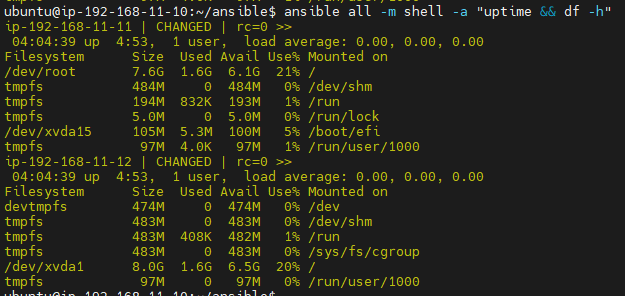
</p>

To copy files or install packages you can run the following command and set the state to **"present"**. You should choose `-b` or `-become` flag to run the module with `sudo` privilege in the managed nodes. If you have set the password for the sudo user, then you should pass `-K` along with the `-b` flag which will prompt for the **become** password.
```console
ansible all -m apt -a "name=cowsay,vim,cmatrix state=present" -b -K
```
**Example of** `copy file`:
```console
echo "Hello DevOPS!" > hello.txt
cat hello.txt
> Hello DevOPS!
##################################################
ansible all -m copy -a "src=hello.txt dest=/home" -b      # `-b` or `-become` flag to run the module with `sudo` privilege in the managed nodes.
ansible all -m copy -a "src=hello.txt dest=/home" -b -K   # if you have set the password for the sudo user, then you should pass `-K`
##################################################
ansible all -m shell -a "cat /home/hello.txt"
> ip-192-168-11-12 | CHANGED | rc=0 >>
>> Hello DevOPS!
> ip-192-168-11-11 | CHANGED | rc=0 >>
>> Hello DevOPS!

##################################################
# Delete this files
ansible all -m file -a "path=/home/hello.txt state=absent" -b
```
<p align="center">
  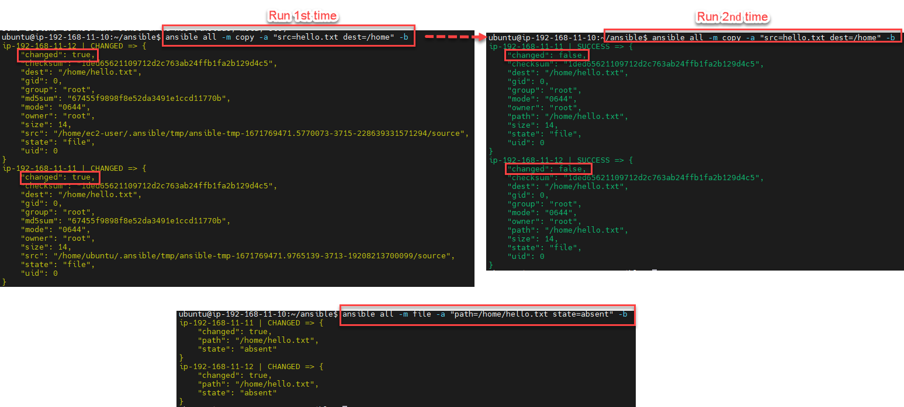
</p>

**Example of** `installing package`:
```console
ansible all -m yum -a "name=httpd state=latest" -b

ansible test -m service -a "name=httpd state=started enabled=yes" -b      # host.txt => [test] => ip-192-168-11-12

ansible test -m shell -a "curl http://2ip.ua"
>  ip : 13.38.108.20

##################################################
# Remove httpd
ansible test -m yum -a "name=httpd state=removed" -b
```
<p align="center">
  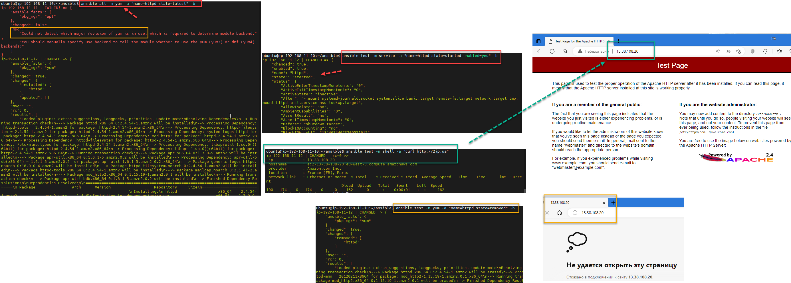
</p>

## [3. Playbooks](https://ostechnix.com/ansible-playbooks/)  
The playbook is a YAML file that is used to execute one or more tasks against the managed hosts in the environment.  

The main difference between ad hoc commands and playbooks is with adhoc commands you can create simple one-liners or use the adhoc command in shell scripts to run simple tasks. When you want to do complex repetitive operations then you should write playbooks and store them in a central repository and use them whenever needed.  

### 3.1. First playbook - "Connection Testing"
Create 1st playbook :
```yml
nano playbook1.yml

ansible-playbook playbook1.yml

# !!! playbook1.yml !!!
---
- name: Connection Testing
  hosts: all
  become: yes               # `-b` or `-become` flag to run the module with `sudo` privilege in the managed nodes.

  tasks:

  - name: Ping servers
    ping:
```
And check it `ansible-playbook playbook1.yml`:
<p align="center">
  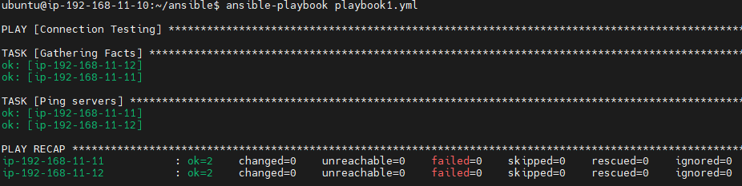
</p>

### 3.2. Playbook - "Install Apache Web Server on AMI Linux"
Create 2nd playbook:
```yml
nano playbook2.yml

ansible-playbook playbook2.yml

# !!! playbook2.yml !!!
---
- name: Install Apache Web Server on AMI Linux
  hosts: all
  become: yes               # `-b` or `-become` flag to run the module with `sudo` privilege in the managed nodes.

  tasks:
  - name: Install Apache Web Server
    yum:  name=httpd state=latest

  - name: Start Apache and enable it during boot
    service: name=httpd state=started enabled=yes
```
<p align="center">
  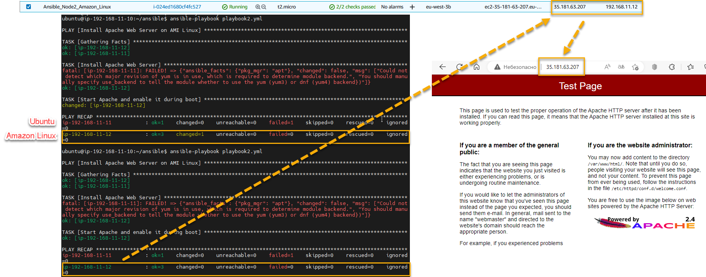
</p>

### 3.3. Playbook - "Upload web page example"
Create 3a playbook with old version for module `copy: src={{ source_file }} dest={{ destin_file }} mode=0555`:
```yml
nano playbook3a.yml

ansible-playbook playbook3a.yml

# !!! playbook3a.yml !!!
---
- name: Install Apache Web Server on AMI Linux. Upload web page example
  hosts: all
  become: yes               # `-b` or `-become` flag to run the module with `sudo` privilege in the managed nodes.

  vars:
    source_file: index.html
    destin_file: /var/www/html

  tasks:
  - name: Install Apache Web Server
    yum:  name=httpd state=latest

  - name: Copy index.html to target server
    copy: src={{ source_file }} dest={{ destin_file }} mode=0555

  - name: Start Apache and enable it during boot
    service: name=httpd state=started enabled=yes
```
Add file `index.hmtl`:
```html
<!DOCTYPE html>
<html style="font-size: 16px;" lang="ru"><head>
    <meta name="viewport" content="width=device-width, initial-scale=1.0">
    <meta charset="utf-8">
	
	<head>
	<title>Ansible - DevOps Fundamentals 2022</title>
	</head>
        
    <body>
      <center>
            <p style="text-align:center">
              <h1 style="background-color:powderblue;">Ansible Playbook</h1>
              <h2>L1 EPAM</h2>
			        <h2>DevOps Fundamentals 2022</h2>
            </p>

            
      </center>
    </body>
</html>
```
<p align="center">
  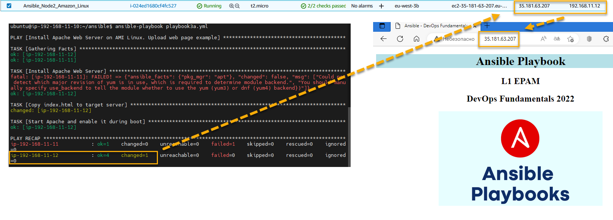
</p>

Create playbook 3b, add *"restart"* and wait info from **"handlers"**:
```yml
nano playbook3b.yml

ansible-playbook playbook3b.yml

# !!! playbook3b.yml !!!
---
- name: Install Apache Web Server on AMI Linux. Upload web page example
  hosts: all
  become: yes               # `-b` or `-become` flag to run the module with `sudo` privilege in the managed nodes.

  vars:
    source_file: index.html
    destin_file: /var/www/html

  tasks:
  - name: Install Apache Web Server
    yum:  name=httpd state=latest

  - name: Copy index.html to target server
    copy: src={{ source_file }} dest={{ destin_file }} mode=0555
    notify: Restart Apache                                        # Add to 3b variant

  - name: Start Apache and enable it during boot
    service: name=httpd state=started enabled=yes

  handlers:
  - name: Restart Apache                                          # Add to 3b variant 
    service: name=httpd state=restarted                           # Add to 3b variant 
```
<p align="center">
  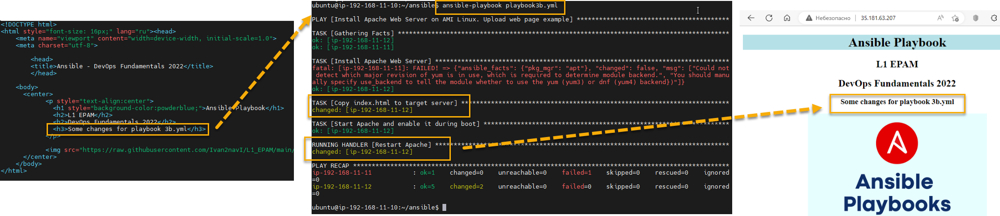
</p>

### 3.4. Playbook 3с/4 - "Installing a web page on all versions of Linux systems"
Create playbook 3с, add **debug** and **when** checking:
```yml
nano playbook3c.yml

ansible-playbook playbook3c.yml

# !!! playbook3c.yml !!!
---
- name: Install Apache Web Server on AMI Linux. Upload web page example
  hosts: all
  become: yes               # `-b` or `-become` flag to run the module with `sudo` privilege in the managed nodes.

  vars:
    source_file: index.html
    destin_file: /var/www/html

  tasks:
  - name:  Check Linux distro                                     # Add to 3c variant
    debug: var=ansible_os_family                                  # Add to 3c variant

  - name: Install Apache Web Server on AWS Linux / RedHat
    yum:  name=httpd state=latest
    when: ansible_os_family == "RedHat"                            # Add to 3c variant

  - name: Install Apache Web Server on Ubuntu / Debian             # Add to 3c variant
    apt:  update_cache=yes name=apache2 state=latest               # Add to 3c variant
    when: ansible_os_family == "Debian"                            # Add to 3c variant

  - name: Copy index.html to target server AWS Linux / RedHat
    copy: src={{ source_file }} dest={{ destin_file }} mode=0555
    notify: Restart Apache RedHat                                  # Add to 3c variant
    when: ansible_os_family == "RedHat"                            # Add to 3c variant

  - name: Copy index.html to target server Ubuntu / Debian 
    copy: src={{ source_file }} dest={{ destin_file }} mode=0555
    notify: Restart Apache Debian                                  # Add to 3c variant
    when: ansible_os_family == "Debian"                            # Add to 3c variant

  - name: Start Apache and enable it during boot
    service: name=httpd state=started enabled=yes
    when: ansible_os_family == "RedHat"                            # Add to 3c variant

  - name: Start Apache and enable it during boot                   # Add to 3c varian
    service: name=apache2 state=started enabled=yes                # Add to 3c varian
    when: ansible_os_family == "Debian"                            # Add to 3c variant

  handlers:
  - name: Restart Apache RedHat
    service: name=httpd state=restarted

  - name: Restart Apache Debian                                   # Add to 3c variant
    service: name=apache2 state=restarted                         # Add to 3c variant
```
<p align="center">
  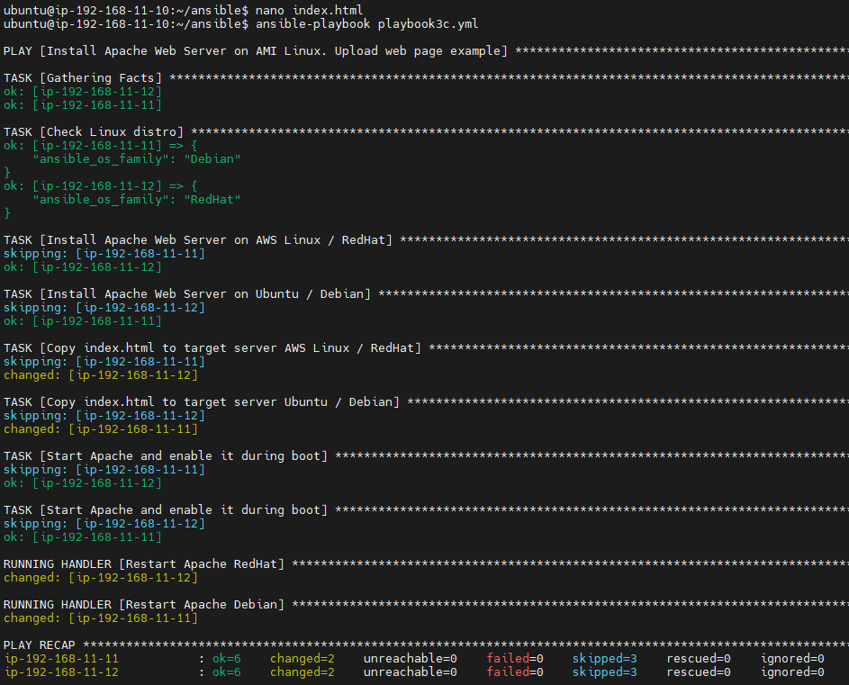
</p>

And now we can use **block** for `playbook4.yml`:
```yml
nano playbook4.yml

ansible-playbook playbook4.yml

# !!! playbook4.yml !!!
---
- name: Install Apache Web Server on AMI Linux. Upload web page example
  hosts: all
  become: yes               # `-b` or `-become` flag to run the module with `sudo` privilege in the managed nodes.

  vars:
    source_file: index.html
    destin_file: /var/www/html

  tasks:
  - name:  Check Linux distro
    debug: var=ansible_os_family

  - block: # For "RedHat"

    - name: Install Apache Web Server on AWS Linux / RedHat
      yum:  name=httpd state=latest

    - name: Copy index.html to target server AWS Linux / RedHat
      copy: src={{ source_file }} dest={{ destin_file }} mode=0555
      notify: Restart Apache RedHat

    - name: Start Apache and enable it during boot
      service: name=httpd state=started enabled=yes

    - name: Add OS info
      shell: |
        OS_VERSION=$(cat /etc/os-release | grep "PRETTY_NAME" | sed 's/PRETTY_NAME=//' | sed 's/\"//g')
        echo "<h3 style="color:DeepSkyBlue" align="center">$OS_VERSION</h3>" >> index.html
      args:
        chdir: "/var/www/html/"
    
    when: ansible_os_family == "RedHat"

  - block: # For "Debian"

    - name: Install Apache Web Server on Ubuntu / Debian
      apt:  update_cache=yes name=apache2 state=latest

    - name: Copy index.html to target server Ubuntu / Debian
      copy: src={{ source_file }} dest={{ destin_file }} mode=0555
      notify: Restart Apache Debian

    - name: Start Apache and enable it during boot
      service: name=apache2 state=started enabled=yes

    - name: Add OS info
      #shell: cat /etc/os-release | grep "PRETTY_NAME" | sed 's/PRETTY_NAME=//' | sed 's/\"//g' >> /var/www/html/index.html
      shell: |
        OS_VERSION=$(cat /etc/os-release | grep "PRETTY_NAME" | sed 's/PRETTY_NAME=//' | sed 's/\"//g')
        echo "<h3 style="color:Orange" align="center">$OS_VERSION</h3>" >> index.html
      args:
        chdir: "/var/www/html/"

    when: ansible_os_family == "Debian"

  handlers:
  - name: Restart Apache RedHat
    service: name=httpd state=restarted

  - name: Restart Apache Debian
    service: name=apache2 state=restarted
```
### [3.5. LOOP Playbook](https://www.linuxtechi.com/how-to-use-loops-in-ansible-playbook/)
As with any programming language, loops in Ansible provide an easier way of executing repetitive tasks using fewer lines of code in a playbook.
```yml
nano playbook_loop1.yml

ansible-playbook playbook_loop1.yml

# !!! playbook_loop1.yml !!!
---
- name: LOOP Playbook
  hosts: linux
  become: yes               # `-b` or `-become` flag to run the module with `sudo` privilege in the managed nodes.

  tasks:
  - name: Hello World
    debug: msg="Hello {{ item }}"
    with_items:
      - "Frontend"
      - ".NET"
      - "Java"
 
 # Add new tasks

  - name: Until example
    shell: echo -n A >> example.txt && cat example.txt
    register: output
    delay: 2
    retries: 5
    until: output.stdout.find("AAA") == false

  - name: Print Output
    debug:
      var: output.stdout
```

And now we can use **loop** for `playbook5.yml` and use [index.html](https://github.com/Ivan2navI/L1_EPAM/tree/main/10.%20Ansible/.info/Loop_Site):
```yml
nano playbook5.yml

ansible-playbook playbook5.yml

# !!! playbook_loop1.yml !!!
---
- name: LOOP Playbook. Install Apache Web Server on AMI Linux. Upload web page example 
  hosts: all
  become: yes               # `-b` or `-become` flag to run the module with `sudo` privilege in the managed nodes.

  vars:
    source_dir: ./Loop_Site
    destin_dir: /var/www/html

  tasks:
  - name:  Check Linux distro
    debug: var=ansible_os_family

  - block: # For "RedHat"

    - name: Install Apache Web Server on AWS Linux / RedHat
      yum:  name=httpd state=latest

    - name: Start Apache and enable it during boot
      service: name=httpd state=started enabled=yes

    when: ansible_os_family == "RedHat"

  - block: # For "Debian"

    - name: Install Apache Web Server on Ubuntu / Debian
      apt:  update_cache=yes name=apache2 state=latest

    - name: Start Apache and enable it during boot
      service: name=apache2 state=started enabled=yes

    when: ansible_os_family == "Debian"


  - name: Copy index.html to target server Ubuntu / Debian
    copy: src={{ source_dir }}/{{ item }} dest={{ destin_dir }} mode=0555
    loop:
      - "index.html"
      - "Ansible_Loop.png"
    notify:
        - Restart Apache Debian
        - Restart Apache RedHat

  - name: Add OS info
    shell: |
      OS_VERSION=$(cat /etc/os-release | grep "PRETTY_NAME" | sed 's/PRETTY_NAME=//' | sed 's/\"//g')
      echo "<h3 style="color:MediumVioletRed" align="center">$OS_VERSION</h3>" >> index.html
      
      IP_ADR=$(hostname -I)
      echo "<h4 style="color:MediumVioletRed" align="center">$IP_ADR</h4>" >> index.html
    args:
      chdir: "/var/www/html/"

  handlers:
  - name: Restart Apache RedHat
    service: name=httpd state=restarted
    when: ansible_os_family == "RedHat"

  - name: Restart Apache Debian
    service: name=apache2 state=restarted
    when: ansible_os_family == "Debian"
```
<p align="center">
  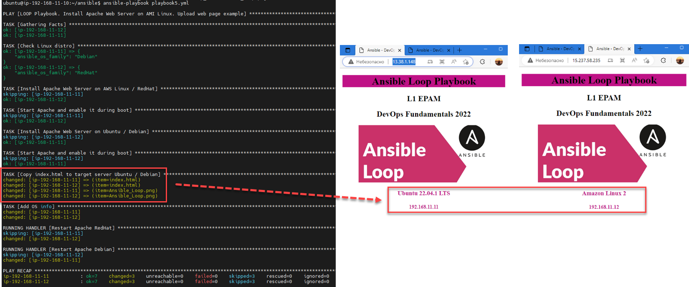
</p>

### [3.6. Templating (Jinja2)](https://docs.ansible.com/ansible/latest/playbook_guide/playbooks_templating.html)  
➢ [Discovering variables: facts and magic variables](https://docs.ansible.com/ansible/latest/playbook_guide/playbooks_vars_facts.html);  
➢ [How to Use Jinja2 Template in Ansible Playbook](https://www.linuxtechi.com/configure-use-ansible-jinja2-templates/);  
➢ [Template Designer Documentation](https://jinja.palletsprojects.com/en/latest/templates/);  
➢ [Ansible Template Module With Examples](https://tekneed.com/using-ansible-template-module-with-ansible-jinja2/#ansible-template-module-with-examples).  


Ansible uses Jinja2 templating to enable dynamic expressions and access to variables and facts. You can use templating with the template module. For example, you can create a template for a configuration file, then deploy that configuration file to multiple environments and supply the correct data (IP address, hostname, version) for each environment. You can also use templating in playbooks directly, by templating task names and more. You can use all the standard filters and tests included in Jinja2. Ansible includes additional specialized filters for selecting and transforming data, tests for evaluating template expressions, and Lookup plugins for retrieving data from external sources such as files, APIs, and databases for use in templating.

Web file **index.j2** is [here](https://github.com/Ivan2navI/L1_EPAM/tree/main/10.%20Ansible/.info/Loop_Site):
```yml
nano playbook5a.yml

ansible-playbook playbook5a.yml

# !!! playbook_loop1.yml !!!
---
- name: Templating (Jinja2). Install Apache Web Server on AMI Linux. Upload web page example 
  hosts: all
  become: yes               # `-b` or `-become` flag to run the module with `sudo` privilege in the managed nodes.

  vars:
    source_dir: ./Loop_Site
    destin_dir: /var/www/html

  tasks:
  - name:  Check Linux distro
    debug: var=ansible_os_family

  - block: # For "RedHat"

    - name: Install Apache Web Server on AWS Linux / RedHat
      yum:  name=httpd state=latest

    - name: Start Apache and enable it during boot
      service: name=httpd state=started enabled=yes

    when: ansible_os_family == "RedHat"

  - block: # For "Debian"

    - name: Install Apache Web Server on Ubuntu / Debian
      apt:  update_cache=yes name=apache2 state=latest

    - name: Start Apache and enable it during boot
      service: name=apache2 state=started enabled=yes

    when: ansible_os_family == "Debian"


  - name: Create index.html using template
    template: src={{ source_dir }}/index.j2 dest={{ destin_dir }}/index.html mode=0555    #Use template: +  .j2
    notify:
        - Restart Apache Debian
        - Restart Apache RedHat

  - name: Copy image Jinja2.png to Web folder
    copy: src={{ source_dir }}/Jinja2.png dest={{ destin_dir }}/Jinja2.png mode=0555   

  handlers:
  - name: Restart Apache RedHat
    service: name=httpd state=restarted
    when: ansible_os_family == "RedHat"

  - name: Restart Apache Debian
    service: name=apache2 state=restarted
    when: ansible_os_family == "Debian"
```
<p align="center">
  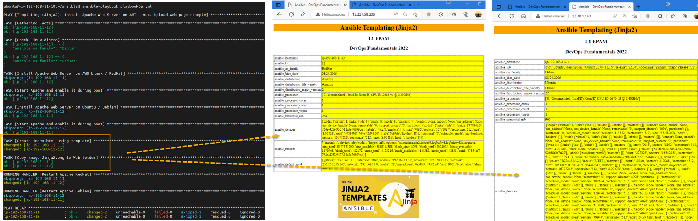
</p>

## [4. Create Ansible Roles](https://www.linuxtechi.com/create-use-ansible-roles-in-playbook/)
Role is a level of abstraction used to simplify how playbook files are written. A role provides a skeleton for reusable components such as variables, modules, tasks, and facts which can be loaded onto a Playbook file.

To create a ansible roles from scratch run ansible galaxy command, example is shown below:  
`$ ansible-galaxy init <role-name>`  
The command creates the `<role-name>` directory. This role directory contains the following directories or folders by default:  
-   The `defaults` folder -- This contains the default variables that will be used by the role.
-   The `files` folder -- Contains files that can be deployed by the role.
-   The `handlers` folder -- Stores handlers that can be used by this role.
-   he `meta` folder -- Contains files that establish the role dependencies.
-   The `tasks` folder -- It contains a YAML file that spells out the tasks for the role itself. Usually, this is the main.yml file.
-   The `templates` folder -- Contains template files that can be modified and allocated to the remote host being provisioned.
-   The `tests` folder -- Integrates testing with Ansible playbook files.
-   The `vars` folder -- Contains variables that are going to be used by the role. You can define them in the playbook file, but it's recommended you define them in this directory.

To view role directory structure, run tree command followed by role name.  
`$ tree <role-name>`

Create `deploy_apache`:
<p align="center">
  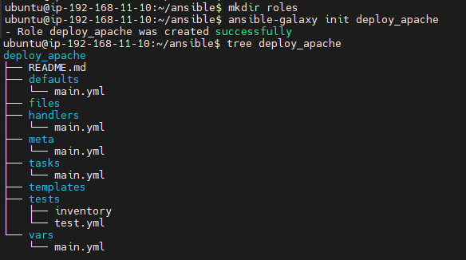
</p>

Modifying the previous playbook to use `deploy_apache`:
<p align="center">
  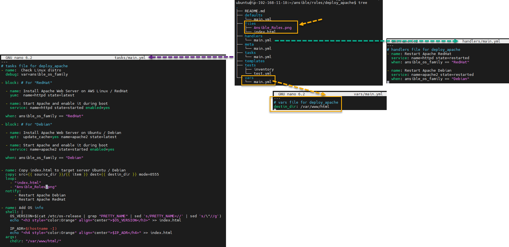
</p>

Create `playbook7.yml` and run it to check results:
```yml
nano playbook7.yml

ansible-playbook playbook7.yml

# !!! Ansible Roles.yml !!!
---
- name: Ansible Roles
  hosts: all
  become: yes               # `-b` or `-become` flag to run the module with `sudo` privilege in the managed nodes.

  roles:
    - role: deploy_apache
```
But we get an error, and to fix it, we need to make the following edits to the `deploy_apache/vars/main.yml` file:  
<p align="center">
  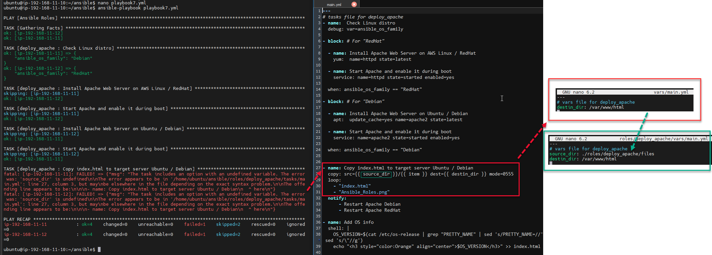
</p>

Add `source_dir: ./roles/deploy_apache/files` and run `playbook7.yml` again:  
<p align="center">
  
</p>


---
### PS: [Paste to Markdown](https://euangoddard.github.io/clipboard2markdown/)

Instructions

    Find the text to convert to Markdown (e.g., in another browser tab)
    Copy it to the clipboard (Ctrl+C, or ⌘+C on Mac)
    Paste it into this window (Ctrl+V, or ⌘+V on Mac)
    The converted Markdown will appear!

The conversion is carried out by [to-markdown](https://github.com/domchristie/to-markdown), a Markdown converter written in JavaScript and running locally in the browser.