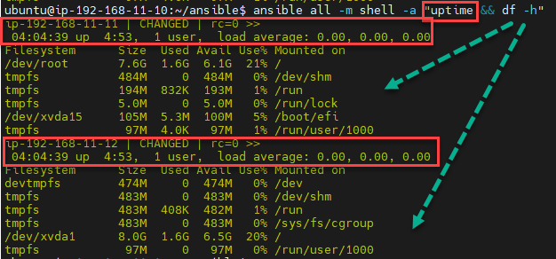

# 10. :a:nsible

## 1. Tech Environment for Ansible Project

<p align="center">
  
</p>

### [The Terraform configuration below:](https://github.com/Ivan2navI/L1_EPAM/tree/main/10.%20Ansible/home_task)
➢ Creates an Internet Gateway and attaches it to the VPC to allow traffic within the VPC to be reachable by the outside world;  
➢ Creates a public subnet;  
➢ Creates a route table for the public subnet and associates the table with the subnet;  
➢ Creates EC2 instances;
<p align="center">
  
</p>

## [2. Install and Configure :a:nsible on Ubuntu 22.04 & Amazon Linux](https://www.digitalocean.com/community/tutorials/how-to-install-and-configure-ansible-on-ubuntu-22-04)

- **Ansible Server (Control Node): [192.168.11.10]** Ubuntu 22.04.1 LTS  
  The Ansible control node is the machine we’ll use to connect to and control the Ansible hosts over SSH.
- One or more Ansible Hosts:  
  An Ansible host is any machine that your Ansible control node is configured to automate.  
  - **Ansible Node1: [192.168.11.11]** Ubuntu 22.04.1 LTS 
  - **Ansible Node2: [192.168.11.12]** Amazon Linux 2 Kernel 5.10 AMI 2.0.20221210.1 

### 2.1. Installing Ansible
To begin using Ansible as a means of managing your server infrastructure, you need to install the Ansible software on the machine that will serve as the Ansible control node.
From your control node, run the following command to include the official project’s PPA (personal package archive) in your system’s list of sources:
```console
sudo apt-add-repository ppa:ansible/ansible

sudo apt update

sudo apt install ansible

# Check version
ansible --version

ansible [core 2.13.7]
  config file = /etc/ansible/ansible.cfg
  configured module search path = ['/home/ubuntu/.ansible/plugins/modules', '/usr/share/ansible/plugins/modules']
  ansible python module location = /usr/lib/python3/dist-packages/ansible
  ansible collection location = /home/ubuntu/.ansible/collections:/usr/share/ansible/collections
  executable location = /usr/bin/ansible
  python version = 3.10.6 (main, Nov  2 2022, 18:53:38) [GCC 11.3.0]
  jinja version = 3.0.3
  libyaml = True
```
### 2.2. Setting Up the Inventory File
The inventory file contains all information about the hosts that you will manage with Ansible.
So, create it:
```console
ubuntu@ip-192-168-11-10:~$  mkdir ansible
ubuntu@ip-192-168-11-10:~$  nano hosts.txt
# !!! hosts.txt !!!
[staging_servers]
Node1_Ubuntu    ansible_hosts=192.168.11.11 ansible_user=ubuntu ansible_ssh_private_key_file=/home/ubuntu/.ssh/ansible_node1.pem
Node2_Ubuntu    ansible_hosts=192.168.11.12 ansible_user=ec2-user ansible_ssh_private_key_file=/home/ubuntu/.ssh/ansible_node2.pem
```
Add `chmod 400` for all `*.pem` keys:
```console
ubuntu@ip-192-168-11-10:~/.ssh$   chmod 400 ansible_node1.pem ansible_node2.pem

ubuntu@ip-192-168-11-10:~/.ssh$   ssh ubuntu@192.168.11.11 -i ~/.ssh/ansible_node1.pem

ubuntu@ip-192-168-11-10:~/.ssh$   ssh ec2-user@192.168.11.12 -i ~/.ssh/ansible_node2.pem
```
And then try commnd `ansible -i hosts.txt all -m ping`,  
but, it caused an error:
<p align="center">
  
</p>

To get a real hostnames of the instances use:
```console
ubuntu@ip-192-168-11-10:~$ hostname
> ip-192-168-11-10
```
Modify the `hosts.txt`:
```console
# !!! hosts.txt !!!
[staging_servers]
ip-192-168-11-11    ansible_hosts=192.168.11.11 ansible_user=ubuntu ansible_ssh_private_key_file=/home/ubuntu/.ssh/ansible_node1.pem
ip-192-168-11-12    ansible_hosts=192.168.11.12 ansible_user=ec2-user ansible_ssh_private_key_file=/home/ubuntu/.ssh/ansible_node2.pem
```
Check results `ansible -i hosts.txt all -m ping`:
<p align="center">
  
</p>

### [2.3. Ansible Configuration File](https://ostechnix.com/ansible-inventory-and-configuration-files/)
Ansible uses the configuration file to load the parameters that are required to run the ansible task. If you have installed ansible using the package manager, you will have an `ansible.cfg` file in `/etc/ansible` directory.  
But, I have created a custom project directory and created a `ansible.cfg` file.  
My config file contains only two properties (inventory location, and disabled host key checking):
```console
ubuntu@ip-192-168-11-10:~/ansible$  nano ansible.cfg
##############################
# !!! ansible.cfg !!!
[defaults]
host_key_checking = false
inventory = ./hosts.txt
##############################

# Now ansible -i hosts.txt all -m ping, can use without -i hosts.txt
ubuntu@ip-192-168-11-10:~/ansible$  ansible all -m ping
```

### [2.4. Inventory File With Host Vars, Group Vars & Child Groups](https://ostechnix.com/ansible-inventory-and-configuration-files/)
You can create a group and use other group names under it.  
Inventory file supports host & group variables. Host variables are nothing but variables and their values passed to the host in the inventory file.  
Group vars is same as host vars but the variables will be applied to the entire group instead of a single host. So you can create a group var where the variables will be inherited by all the nodes in the group. You need to add :vars to make the group as group vars.
```console
# !!! hosts.txt !!!
[staging_servers]
ip-192-168-11-11    ansible_hosts=192.168.11.11 ansible_user=ubuntu ansible_ssh_private_key_file=/home/ubuntu/.ssh/ansible_node1.pem

[test]
ip-192-168-11-12    ansible_hosts=192.168.11.12 ansible_user=ec2-user ansible_ssh_private_key_file=/home/ubuntu/.ssh/ansible_node2.pem

[test_prod:children]
staging_servers
test

[test_prod:vars]
ansible_python_interpreter=/usr/bin/python3
```
### [2.5. Ansible Inventory Command](https://ostechnix.com/ansible-inventory-and-configuration-files/)
To get the inventory details in the graph format, use `--graph flag`. If you have different inventory files, you can use -i flag to explicitly point to the inventory file.  
```console
ubuntu@ip-192-168-11-10:~/ansible$ ansible-inventory --graph
@all:
  |--@test_prod:
  |  |--@staging_servers:
  |  |  |--ip-192-168-11-11
  |  |--@test:
  |  |  |--ip-192-168-11-12
  |--@ungrouped:
```
You can print the host and group var information by passing `--vars` flag along with `--graph` flag.
```console
ubuntu@ip-192-168-11-10:~/ansible$ ansible-inventory --graph --vars
@all:
  |--@test_prod:
  |  |--@staging_servers:
  |  |  |--ip-192-168-11-11
  |  |  |  |--{ansible_hosts = 192.168.11.11}
  |  |  |  |--{ansible_python_interpreter = /usr/bin/python3}
  |  |  |  |--{ansible_ssh_private_key_file = /home/ubuntu/.ssh/ansible_node1.pem}
  |  |  |  |--{ansible_user = ubuntu}
  |  |--@test:
  |  |  |--ip-192-168-11-12
  |  |  |  |--{ansible_hosts = 192.168.11.12}
  |  |  |  |--{ansible_python_interpreter = /usr/bin/python3}
  |  |  |  |--{ansible_ssh_private_key_file = /home/ubuntu/.ssh/ansible_node2.pem}
  |  |  |  |--{ansible_user = ec2-user}
  |  |--{ansible_python_interpreter = /usr/bin/python3}
  |--@ungrouped:
```
When you use the `--list` flag, the output will be in JSON format.
```console
ubuntu@ip-192-168-11-10:~/ansible$ ansible-inventory --list
{
    "_meta": {
        "hostvars": {
            "ip-192-168-11-11": {
                "ansible_hosts": "192.168.11.11",
                "ansible_python_interpreter": "/usr/bin/python3",
                "ansible_ssh_private_key_file": "/home/ubuntu/.ssh/ansible_node1.pem",
                "ansible_user": "ubuntu"
            },
            "ip-192-168-11-12": {
                "ansible_hosts": "192.168.11.12",
                "ansible_python_interpreter": "/usr/bin/python3",
                "ansible_ssh_private_key_file": "/home/ubuntu/.ssh/ansible_node2.pem",
                "ansible_user": "ec2-user"
            }
        }
    },
    "all": {
        "children": [
            "test_prod",
            "ungrouped"
        ]
    },
    "staging_servers": {
        "hosts": [
            "ip-192-168-11-11"
        ]
    },
    "test": {
        "hosts": [
            "ip-192-168-11-12"
        ]
    },
    "test_prod": {
        "children": [
            "staging_servers",
            "test"
        ]
    }
}
```
`ansible-inventory --list -y` containing your own server infrastructure as defined in your inventory file:
```console
ubuntu@ip-192-168-11-10:~/ansible$ ansible-inventory --list -y
all:
  children:
    test_prod:
      children:
        staging_servers:
          hosts:
            ip-192-168-11-11:
              ansible_hosts: 192.168.11.11
              ansible_python_interpreter: /usr/bin/python3
              ansible_ssh_private_key_file: /home/ubuntu/.ssh/ansible_node1.pem
              ansible_user: ubuntu
        test:
          hosts:
            ip-192-168-11-12:
              ansible_hosts: 192.168.11.12
              ansible_python_interpreter: /usr/bin/python3
              ansible_ssh_private_key_file: /home/ubuntu/.ssh/ansible_node2.pem
              ansible_user: ec2-user
    ungrouped: {}
```

### [2.6. setup - Gathers facts about remote hosts](https://docs.ansible.com/ansible/2.5/modules/setup_module.html)
This module is automatically called by playbooks to gather useful variables about remote hosts that can be used in playbooks.
<p align="center">
  
</p>

### [2.7. Ad hoc Command](https://ostechnix.com/ansible-ad-hoc-commands/)
There are a few inputs you have to provide when running the ad hoc command:
- You have to specify the targets(managed nodes). Either you can use the default "all/ungrouped" groups or user-defined groups.
- You have to pass the module name as an argument to the -m flag.
- Every module accepts a set of options. Those options should be passed as arguments to -a flag. If there are multiple options then they should be enclosed within quotes.
```console
$ ansible [group] -m [module] -a [module arguments]
```
You can combine other arguments we have seen in the previous sections into ad hoc commands.
Example **"uptime && df -h"** for all nodes: `ansible all -m shell -a "uptime && df -h"`
<p align="center">
  
</p>

To copy files or install packages you can run the following command and set the state to **"present"**. You should choose `-b` or `-become` flag to run the module with `sudo` privilege in the managed nodes. If you have set the password for the sudo user, then you should pass `-K` along with the `-b` flag which will prompt for the **become** password.
```console
ansible all -m apt -a "name=cowsay,vim,cmatrix state=present" -b -K
```
**Example of** `copy file`:
```console
echo "Hello DevOPS!" > hello.txt
cat hello.txt
> Hello DevOPS!
##################################################
ansible all -m copy -a "src=hello.txt dest=/home" -b      # `-b` or `-become` flag to run the module with `sudo` privilege in the managed nodes.
ansible all -m copy -a "src=hello.txt dest=/home" -b -K   # if you have set the password for the sudo user, then you should pass `-K`
##################################################
ansible all -m shell -a "cat /home/hello.txt"
> ip-192-168-11-12 | CHANGED | rc=0 >>
>> Hello DevOPS!
> ip-192-168-11-11 | CHANGED | rc=0 >>
>> Hello DevOPS!

##################################################
# Delete this files
ansible all -m file -a "path=/home/hello.txt state=absent" -b
```
<p align="center">
  
</p>

**Example of** `installing package`:
```console
ansible all -m yum -a "name=httpd state=latest" -b

ansible test -m service -a "name=httpd state=started enabled=yes" -b      # host.txt => [test] => ip-192-168-11-12

ansible test -m shell -a "curl http://2ip.ua"
>  ip : 13.38.108.20

##################################################
# Remove httpd
ansible test -m yum -a "name=httpd state=removed" -b
```
<p align="center">
  
</p>

## [3. Playbooks](https://ostechnix.com/ansible-playbooks/)  
The playbook is a YAML file that is used to execute one or more tasks against the managed hosts in the environment.  

The main difference between ad hoc commands and playbooks is with adhoc commands you can create simple one-liners or use the adhoc command in shell scripts to run simple tasks. When you want to do complex repetitive operations then you should write playbooks and store them in a central repository and use them whenever needed.  

### 3.1. First playbook - "Connection Testing"
Create 1st playbook :
```console
nano playbook1.yml

ansible-playbook playbook1.yml

# !!! playbook1.yml !!!
---
- name: Connection Testing
  hosts: all
  become: yes               # `-b` or `-become` flag to run the module with `sudo` privilege in the managed nodes.

  tasks:

  - name: Ping servers
    ping:
```
And check it `ansible-playbook playbook1.yml`:
<p align="center">
  
</p>

### 3.2. Playbook - "Install Apache Web Server on AMI Linux"
Create 2nd playbook:
```console
nano playbook2.yml

ansible-playbook playbook2.yml

# !!! playbook2.yml !!!
---
- name: Install Apache Web Server on AMI Linux
  hosts: all
  become: yes               # `-b` or `-become` flag to run the module with `sudo` privilege in the managed nodes.

  tasks:
  - name: Install Apache Web Server
    yum:  name=httpd state=latest

  - name: Start Apache and enable it during boot
    service: name=httpd state=started enabled=yes
```
<p align="center">
  
</p>

### 3.3. Playbook - "Upload web page example"
Create 3a playbook with old version for module `copy: src={{ source_file }} dest={{ destin_file }} mode=0555`:
```console
nano playbook3a.yml

ansible-playbook playbook3a.yml

# !!! playbook3a.yml !!!
---
- name: Install Apache Web Server on AMI Linux. Upload web page example
  hosts: all
  become: yes               # `-b` or `-become` flag to run the module with `sudo` privilege in the managed nodes.

  vars:
    source_file: index.html
    destin_file: /var/www/html

  tasks:
  - name: Install Apache Web Server
    yum:  name=httpd state=latest

  - name: Copy index.html to target server
    copy: src={{ source_file }} dest={{ destin_file }} mode=0555

  - name: Start Apache and enable it during boot
    service: name=httpd state=started enabled=yes
```
Add file `index.hmtl`:
```html
<!DOCTYPE html>
<html style="font-size: 16px;" lang="ru"><head>
    <meta name="viewport" content="width=device-width, initial-scale=1.0">
    <meta charset="utf-8">
	
	<head>
	<title>Ansible - DevOps Fundamentals 2022</title>
	</head>
        
    <body>
      <center>
            <p style="text-align:center">
              <h1 style="background-color:powderblue;">Ansible Playbook</h1>
              <h2>L1 EPAM</h2>
			        <h2>DevOps Fundamentals 2022</h2>
            </p>

            
      </center>
    </body>
</html>
```
<p align="center">
  
</p>