# 5. Azure Cloud

## Prerequisites
__1. Create azure subscription__ \
__2. Create azure devops organization__ \
__3. Read information about github flow branching strategy__ \
__4. terraform should be installed__ \
__5. Terraform knowledge is also required to do the stuff__ \
__6. Az  cli should  be  installed__

### ----------------------- Homework -----------------------

### Part 1 -- Configure application
#### 1. Create a service connection in a Azure DevOps project to your subscription [(link)](<https://learn.microsoft.com/en-us/azure/devops/pipelines/library/service-endpoints?view=azure-devops&tabs=yaml>)

:bulb: __Answer__:
<p align="center">
  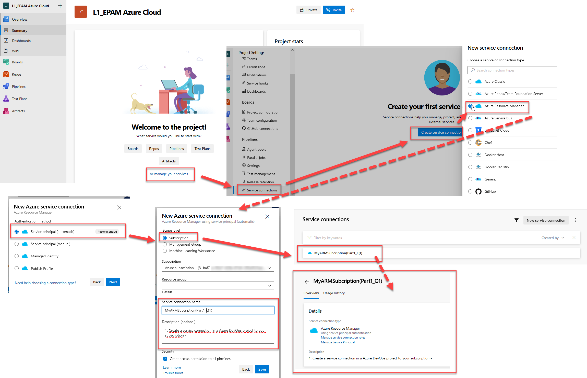
</p>

---
#### 2. Find a .net pet project for the experiments

:bulb: __Answer__: \
Create a .NET project :arrow_right: <https://learn.microsoft.com/en-us/azure/devops/pipelines/ecosystems/dotnet-core?view=azure-devops&tabs=dotnetfive>

---
#### 3. Build your app locally .net project via dotnet tool. dotnet restore/build/run 

:bulb: __Answer__:

__3.1. Troubleshoot .NET tool usage issues__ \
An attempt to run the application displays an error.
```console
PS E:\Azure_Home_Task> dotnet new webapp -f net6.0
Could not execute because the application was not found or a compatible .NET SDK is not installed.
Possible reasons for this include:
  * You intended to execute a .NET program:
      The application 'new' does not exist.
  * You intended to execute a .NET SDK command:
      It was not possible to find any installed .NET SDKs.
      Install a .NET SDK from:
        https://aka.ms/dotnet-download

PS E:\Azure_Home_Task> dotnet --list-runtimes
    Microsoft.NETCore.App 5.0.10 [C:\Program Files (x86)\dotnet\shared\Microsoft.NETCore.App]
    Microsoft.WindowsDesktop.App 5.0.10 [C:\Program Files (x86)\dotnet\shared\Microsoft.WindowsDesktop.App]

PS E:\Azure_Home_Task> dotnet --info
Host (useful for support):
  Version: 5.0.10
  Commit:  e1825b4928

.NET SDKs installed:
  No SDKs were found.

.NET runtimes installed:
  Microsoft.NETCore.App 5.0.10 [C:\Program Files (x86)\dotnet\shared\Microsoft.NETCore.App]
  Microsoft.WindowsDesktop.App 5.0.10 [C:\Program Files (x86)\dotnet\shared\Microsoft.WindowsDesktop.App]

To install additional .NET runtimes or SDKs:
  https://aka.ms/dotnet-download
```
Learned these materials:
<https://learn.microsoft.com/ru-ru/dotnet/core/tools/troubleshoot-usage-issues> \
<https://learn.microsoft.com/ru-ru/dotnet/core/tools/dotnet-tool-install?source=recommendations>

Completed the settings for the PC:
- Use:
```console
dotnet-install.ps1 -Channel 7.0 -Runtime aspnetcore
```
- OR:
<p align="center">
  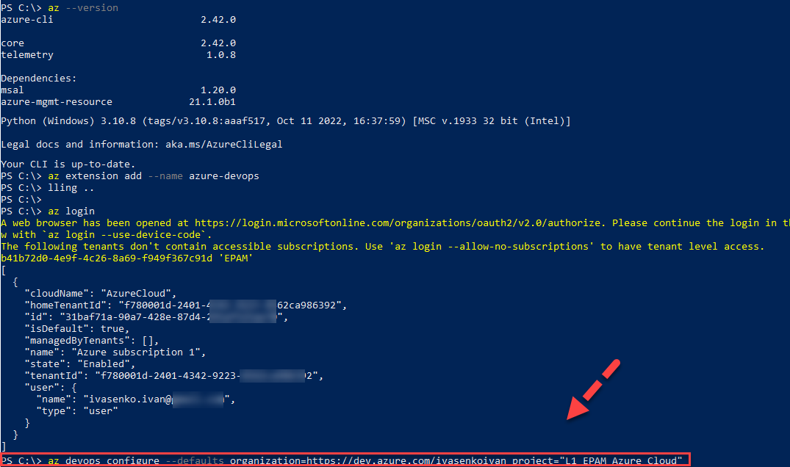
</p>

__3.2. Check & Create a .NET project:__
```console
PS E:\Azure_Home_Task> dotnet --list-runtimes
      Microsoft.AspNetCore.App 6.0.11 [C:\Program Files\dotnet\shared\Microsoft.AspNetCore.App]
      Microsoft.NETCore.App 6.0.11 [C:\Program Files\dotnet\shared\Microsoft.NETCore.App]
      Microsoft.WindowsDesktop.App 6.0.11 [C:\Program Files\dotnet\shared\Microsoft.WindowsDesktop.App]
```
```console
# Create a new .NET 6 webapp.
# .NET CLI
dotnet new webapp -f net6.0

# From the same terminal session, run the application locally using the dotnet run command from your project directory.
# .NET CLI
dotnet run
```
<p align="center">
  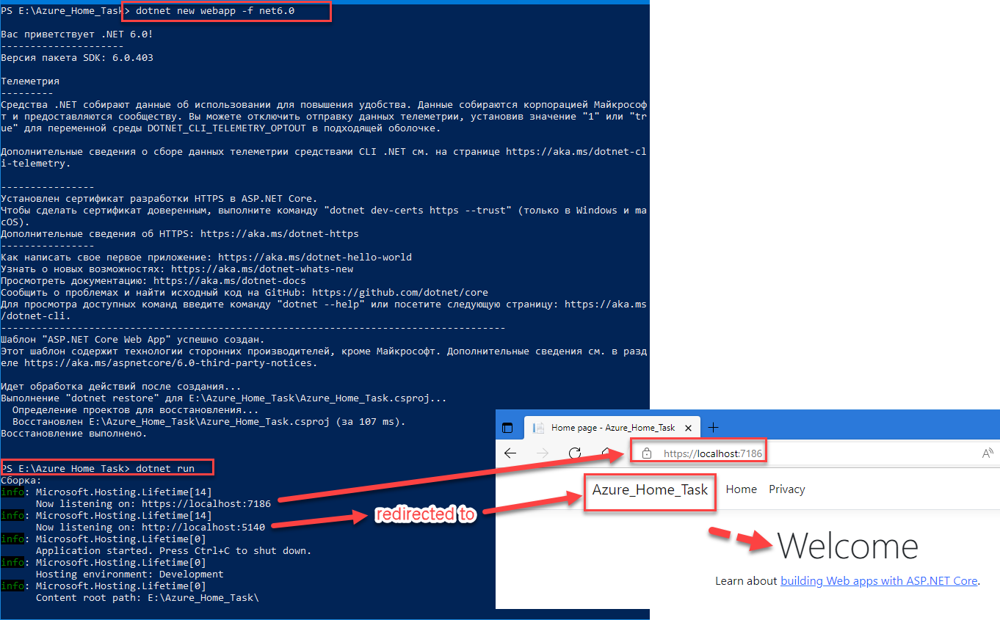
</p>

---
#### 4. Create an Azure DevOps repo -  https://learn.microsoft.com/en-us/azure/devops/repos/git/create-new-repo?view=azure-devops. You can use import  repository to import from existing source control version like github

:bulb: __Answer__: \
__4.1. Download and install Azure CLI and add Azure DevOps extension [(link)](<https://learn.microsoft.com/en-us/azure/devops/repos/git/share-your-code-in-git-cmdline?view=azure-devops>)__
-  [Install the Azure CLI](https://learn.microsoft.com/en-us/cli/azure/install-azure-cli). You must have at least `v2.0.49`, which you can verify with `az --version` command.
-  Add the Azure DevOps Extension `az extension add --name azure-devops`
-  Run the `az login` command.
    If the CLI can open your default browser, it will do so and load a sign-in page. Otherwise, you need to open a browser page and follow the instructions on the command line to enter an authorization code after navigating to <https://aka.ms/devicelogin> in your browser. For more information, see the [Azure CLI login page](https://learn.microsoft.com/en-us/cli/azure/authenticate-azure-cli?preserve-view=true&view=azure-cli-latest).
-  For seamless commanding, set the organization and project as defaults in configuration. \
    `az devops configure --defaults organization=https://dev.azure.com/ivasenkoivan project="L1_EPAM Azure Cloud"`
<p align="center">
  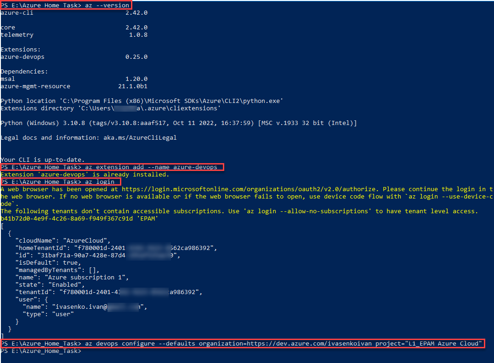
</p>

__4.2. Create Git repo in Azure Repos__

Create local repo.
```console
git init .

git add --all

git commit -m "first commit of my code"
```
Create a new Git repo in Azure Repos for ".NET 6 webapp".
`az repos create --name Test_Web_App` \
Copy the clone URL from the remote URL attribute in the JSON output.

Connect local repo to the Git repo in Azure Repos using the copied clone URL in the git remote command: \
`git remote add origin "https://dev.azure.com/ivasenkoivan/L1_EPAM%20Azure%20Cloud/_git/Test_Web_App"`

<p align="center">
  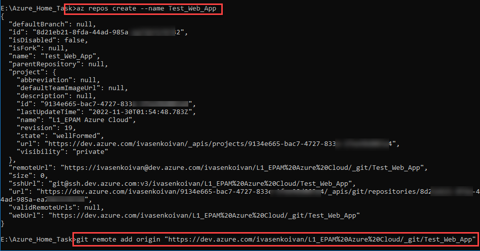
</p>

Before pushing code, set up authentication with "Credential Managers". \
`git push --set-upstream origin master`

<p align="center">
  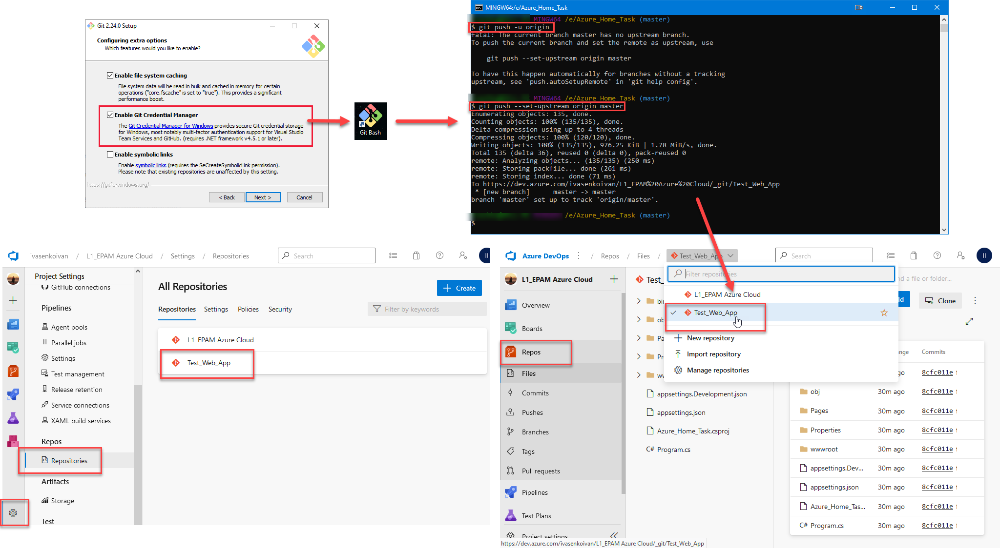
</p>

---
#### 5. Create a branching policy for you application. Added yourself as a reviewer - <https://learn.microsoft.com/en-us/azure/devops/repos/git/branch-policies?view=azure-devops&tabs=browser>. As branching strategy use a github flow (It will be applied by default when you strict commit to your main branch)
:bulb: __Answer__:

:grey_question:__5.1. [Git Flow to the rescue](https://devtks.github.io/2019-08-09-GitFlowAzureDevops/)__

With Git Flow branching strategy and some settings on Dev Ops **no commits can be done** directly on the `develop` branch. Each developer is required to create a feature branch off the `develop` branch. All work related to the feature they are working on will be done there. Once a feature is considered done, the developer has to create a pull request to merge their feature into the `develop` branch. Their pull request then has to be reviewed and approved by the project lead, or another member of the team.

Pros we see:

-   It forces the project to be split into little features
-   Corrupted commits don't affect other team members
-   Dev can easily relate their feature (pull request ) with bugs, tasks, and stories
-   Dev branch will receive only approved code (more stable, less potential bugs)

:grey_question:__Pull Request & Azure DevOps to the rescue__

Once a feature is considered done the developer has to create a pull request asking his feature to be merged to the `develop` branch. With a few settings on Azure DevOps, we can set multiple criteria for a pull request to be approved.

-   Be approved by one or multiple team members
-   The project has to build with no errors
-   All code review comments must be resolved
-   One or more work items must be associated with the pull request

A distributed source control system has each user create a copy or clone of a repository on their local machine. All commits made by the user are done so only on their local repository and not directly to the origin repository (server). To synchronize changes between a client and origin repository the user performs, pull and push commands. This allows the user to work independently of others. Then pushing their changes and pulling in the most recent changes when they need to.

In the figure below we have the origin repository while each user has their own repository. With changes being synced back and forth between the origin.

<p align="center">
  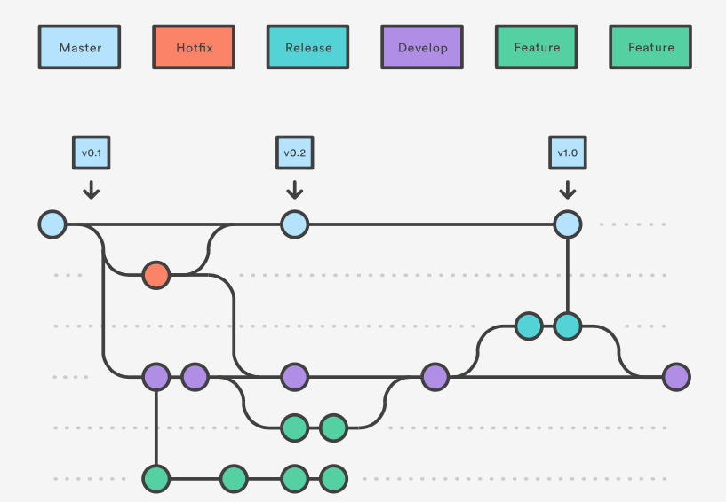
</p>

__Key Benefits of GitFlow__

- __Parallel Development__ \
One of the great things about GitFlow is that it makes parallel development very easy, by isolating new development from finished work. New development (such as features and non-emergency bug fixes) is done in **feature branches**, and is only merged back into main body of code when the developer(s) is happy that the code is ready for release.
Although interruptions are a BadThing(tm), if you are asked to switch from one task to another, all you need to do is commit your changes and then create a new feature branch for your new task. When that task is done, just checkout your original feature branch and you can continue where you left off.

- __Collaboration__ \
Feature branches also make it easier for two or more developers to collaborate on the same feature, because each feature branch is a sandbox where the only changes are the changes necessary to get the new feature working. That makes it very easy to see and follow what each collaborator is doing.

- __Release Staging Area__\
As new development is completed, it gets merged back into the **develop branch**, which is a staging area for all completed features that haven't yet been released. So when the next release is branched off of **develop**, it will automatically contain all of the new stuff that has been finished.

- __Support For Emergency Fixes__ \
GitFlow supports **hotfix branches** - branches made from a tagged release. You can use these to make an emergency change, safe in the knowledge that the hotfix will only contain your emergency fix. There's no risk that you'll accidentally merge in new development at the same time.

__5.2 Setting Branch Policies and Pull Request__

As mentioned earlier we want to block people from pushing directly to the `develop` branch forcing them to create pull request and also setting some rules for a pull request to be approved. (like can’t be approved by yourself and so on.)

Go on Repo-> Branches menu of Azure Devops, and create `develop` branch. \
First, little thing to do (optional) is setting the `develop` branch as the Compare one. Then all the features branch will take the `develop` branch as a comparation reference and show how many commits behind or ahead it is. \
Click on the 3 dots and then `Set as compare branch`
<p align="center">
  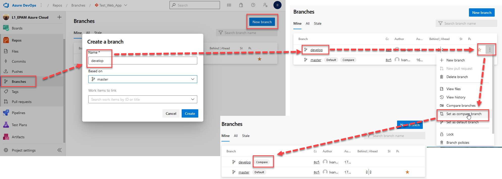
</p>

Then we want to setup Branch Policies by again clicking the 3 dots and then `Branch policies`

Now set the rules as you wish.
-   Having Reviewers
-   Linked work items
-   Resolved Comments
-   Merge type
-   Build validation
-   etc

Activate a reviewer and comment being set to resolve [(link)](https://learn.microsoft.com/en-us/azure/devops/repos/git/repository-settings?view=azure-devops&tabs=browser). 
<p align="center">
  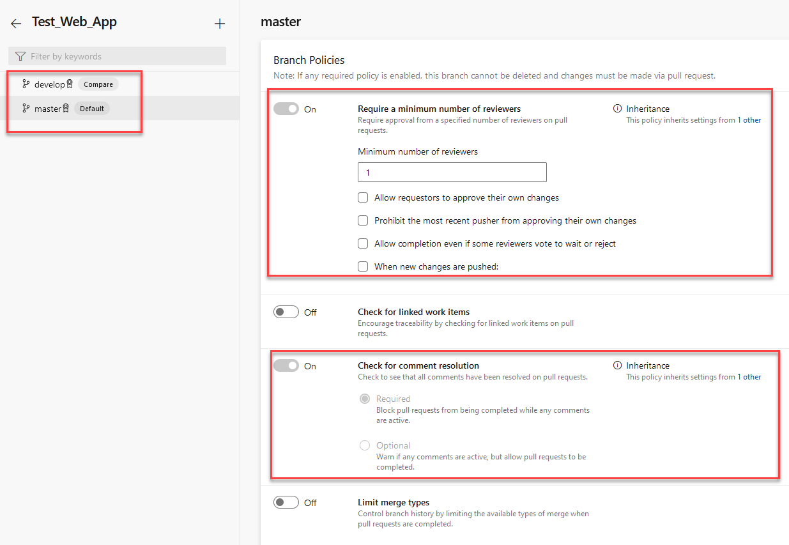
</p>

Add reviewers to pull requests that change files in specific directories and files, or to all pull requests in a repo.
<p align="center">
  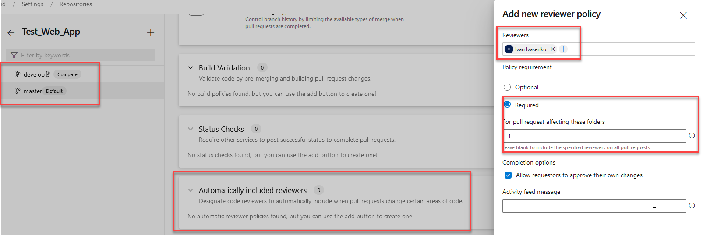
</p>

Check of Git repository settings and policies.
<p align="center">
  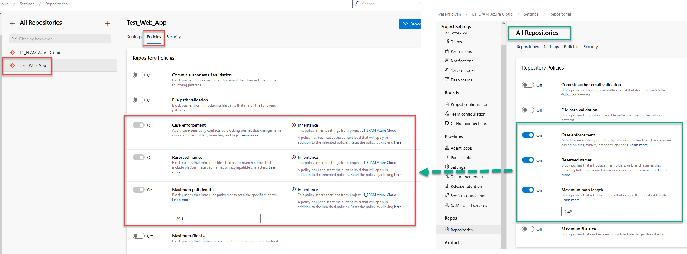
</p>

---

### Part 2 -- Configure a pipeline to deploy infrastructure
Below is describing on how to do it via terraform. If you want to use terraform you need to create  service connection in manual way. Otherwise you won't be able to deploy your iac -- Navigate to the  last section

#### Terraform storage account
1. Create a separate resource group and deploy azure storage account - <https://learn.microsoft.com/en-us/azure/storage/common/storage-account-create?tabs=azure-portal>
2. Create a container with the name “tfstate” and remember the name. use portal settings 
<p align="center">
  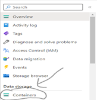
</p>
<p align="center">
  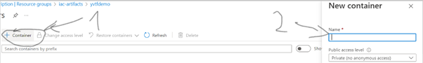
</p>

In this storage account you will be store your tf state file

#### Terraform preparation
1. Create another repo to store devops code
2. Create a folder terraform
3. Add app service implementation - <https://learn.microsoft.com/en-us/azure/app-service/provision-resource-terraform\> 
4. Integrate application insights with app service
5. Updated backend “azurerm” according to the guide - <https://learn.microsoft.com/en-us/azure/developer/terraform/store-state-in-azure-storage?tabs=azure-cli>
<p align="center">
  
</p>
6. Run az login or Connect-AzAccount to connect the azure subscription from your local
7. Run terraform apply to deploy infrastructure

**Important note: Use only freshest version of tf module like** <https://registry.terraform.io/providers/hashicorp/azurerm/latest/docs/resources/windows_web_app>

**Important note: Don’t forget to destroy your application once completed**

#### Create a terraform pipeline
1. Create a yaml pipeline with the following steps: terraform install, terraform init, terraform plan/apply. Plan is an optional one 
2. Inside yaml pipeline add trigger to main branch. The scenario – when main is updated, pipeline should run automatically - <https://learn.microsoft.com/en-us/azure/devops/pipelines/yaml-schema/trigger?view=azure-pipelines>
3. Added 3 steps – terraform install, terraform init, terraform plan/apply. Plan is an optional one. You may add it as 4th step

### Part 3  -- Create a  deploy pipeline to  app service
1. Add yml pipeline to the application folder
2. Your pipeline structure should contain 2 stages. 1st -- build, create zip archieve, and publish an artifact. 2nd -- download an artifact and deploy it to azure app service
3. To deploy .zip to app service use azure app service deployment task

### Service connection -- manual way
<https://4bes.nl/2019/07/11/step-by-step-manually-create-an-azure-devops-service-connection-to-azure/>
Don’t forget to grant access on the subscription level for your enterprise application (service principal)

### Useful readings
1. How to share variables
<p align="center">
  
</p>
2. Templates example for variables - <https://learn.microsoft.com/en-us/samples/azure-samples/azure-pipelines-variable-templates/azure-pipelines-variable-templates/>
3. Good example how to do a pipeline to build .net app and deplot tf iac - <https://azuredevopslabs.com/labs/vstsextend/terraform/> Only via UI. Hence don’t forget about view yaml button in UI
4. Example of the Angular application from lecture 2 - <https://epam-my.sharepoint.com/:u:/p/yevhen_husiev/EWXdflfwT7pBijqGNXZnvRgBRdpB_EXlN0cJy8_SFA6_eA?e=Fc3LQW> password – AQ!sw2DE£fr4

---
### PS: [Paste to Markdown](https://euangoddard.github.io/clipboard2markdown/)

Instructions

    Find the text to convert to Markdown (e.g., in another browser tab)
    Copy it to the clipboard (Ctrl+C, or ⌘+C on Mac)
    Paste it into this window (Ctrl+V, or ⌘+V on Mac)
    The converted Markdown will appear!

The conversion is carried out by [to-markdown](https://github.com/domchristie/to-markdown), a Markdown converter written in JavaScript and running locally in the browser.