# 7. Jenkins

## 1. [How to Install OpenJDK 18 on Ubuntu 22.04 LTS](https://www.linuxcapable.com/how-to-install-openjdk-18-on-ubuntu-22-04-lts/)

The Jenkins project performs a full test flow with the following JDK/JREs:
- OpenJDK JDK / JRE 11 - 64 bits
- OpenJDK JDK / JRE 17 - 64 bits

```bash
sudo apt update && sudo apt upgrade -y

apt-cache search openjdk

sudo apt-get install openjdk-17-jdk -y

java --version

# Updates are handled with the standard apt update and upgrade commands. 
# However, you can remove them separately or altogether if you no longer require JDK or JRE.

Example:
sudo apt-get autoremove openjdk-17-jdk --purge -y
```

## 2. [Installing Jenkins](https://www.jenkins.io/doc/book/installing/linux/)

On Debian and Debian-based distributions like Ubuntu you can install Jenkins through apt.  
A LTS (Long-Term Support) release is chosen every 12 weeks from the stream of regular releases as the stable release for that time period. It can be installed from the debian-stable apt repository.  
```console
curl -fsSL https://pkg.jenkins.io/debian-stable/jenkins.io.key | sudo tee
    /usr/share/keyrings/jenkins-keyring.asc > /dev/null
echo deb [signed-by=/usr/share/keyrings/jenkins-keyring.asc] \
    https://pkg.jenkins.io/debian-stable binary/ | sudo tee \
    /etc/apt/sources.list.d/jenkins.list > /dev/null

sudo apt-get update
sudo apt-get install jenkins

sudo cat /var/lib/jenkins/secrets/initialAdminPassword == a6bfxxxxxx7d0a84bca880xxxxxxxxxxxx
```
__Jenkins to show the UI in English language?__

1. Download and install the locale plugin:
- From the main page of Jenkins, go to Manage Jenkins -> Manage Plugins
- Click on Availables
- Check the "Locale plugin" and clicks on "Download now and install after restart".

Jenkins will download the plugin and restart if not job has been scheduled.

2. Once the plugin has been installed, change the language using following steps:
- From the main page of Jenkins, go to Manage Jenkins -> Configure System.
- Under Locale, there will be a field called "Default Language". Enter the new language. It could be "en" or "ENGLISH".
- Under the text box, check the checkBox called "Ignore browser preference and force this language to all users".

<p align="center">
  
</p>

## 3. Create Simple Job 
<p align="center">
  
</p>

## 4. Deploy from Jenkins over SSH
### 4.1. [Install the Apache Web Server on Main Jenkins Server](https://www.digitalocean.com/community/tutorials/how-to-install-the-apache-web-server-on-ubuntu-22-04)
```console
# Step 1 — Installing Apache
sudo apt update
sudo apt install apache2

# Step 2 — Adjusting the Firewall
sudo ufw app list

# Your output will be a list of the application profiles:
#
# Output
# Available applications:
#  Apache
#  Apache Full
#  Apache Secure
#  OpenSSH

# As indicated by the output, there are three profiles available for Apache:
# 	- Apache: This profile opens only port 80 (normal, unencrypted web traffic)
# 	- Apache Full: This profile opens both port 80 (normal, unencrypted web traffic) and port 443 (TLS/SSL encrypted traffic)
# 	- Apache Secure: This profile opens only port 443 (TLS/SSL encrypted traffic)

# It is recommended that you enable the most restrictive profile that will still allow the traffic you’ve configured. Since you haven’t configured SSL for your server yet in this guide, you’ll only need to allow traffic on port 80:
sudo ufw allow 'Apache'

# You can verify the change by checking the status:
sudo ufw status

# Step 3 — Checking your Web Serve
# Make sure the service is active by running the command for the systemd init system:
sudo systemctl status apache2

# Step 4 — Managing the Apache Process
sudo systemctl stop apache2

sudo systemctl start apache2

sudo systemctl restart apache2

sudo systemctl reload apache2

sudo systemctl disable apache2

sudo systemctl enable apache2
```
Create a sample `index.html`:
```html

sudo nano /var/www/html/index.html

# add the following sample HTML:
<html>
    <head>
        <title>Welcome to Jenkins MAIN Server!</title>
    </head>
        
    <body>
      <center>
            <p style="text-align:center">
              <h1>Welcome to Jenkins MAIN Server!</h1>
              <h2>L1 EPAM</h2>
              <a href="http://jenkins1van.myddns.me:8080/">Jenkins MAIN Server</a>
            </p>
            <p style="text-align:center">
              <a href="http://jenkins0agent1van.myddns.me">Agent for Jenkins</a>
            </p>
            
      </center>
    </body>
</html>
```

### 4.2. Install the Apache Web Server for Jenkins Agent
Use the information from the previous paragraph and create a sample `index.html`:
```html
sudo nano /var/www/html/index.html

# add the following sample HTML:
<html>
    <head>
        <title>Welcome to AGENT!</title>
    </head>
        
    <body>
      <center>
            <p style="text-align:center">
              <h1 style="background-color:powderblue;">Welcome to Jenkins AGENT!</h1>
              <h2>L1 EPAM</h2>
            </p>

            
      </center>
    </body>
</html>
```

### 4.3. Deploy from Jenkins MAIN Server to Jenkins Agent over SSH
<p align="center">
  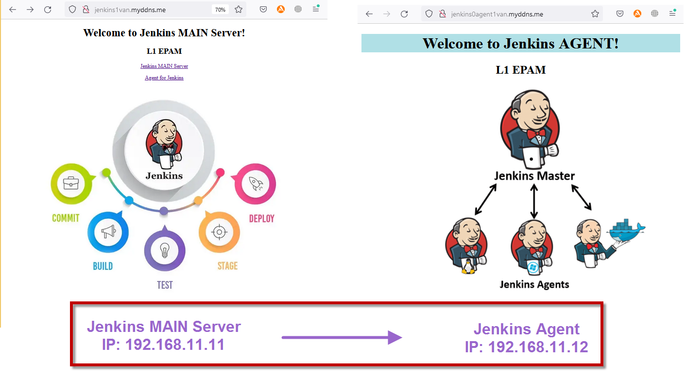
</p>

Check SSH status on bouth servers. 

```console
# Evaluate OpenSSH Status
sudo systemctl status ssh

# The Ubuntu systems ships with default UFW firewall, If the UFW is active, you need to allow SSH port 22 for remote users. To allow port 22 in UFW type:
sudo ufw allow 22/tcp 
```

And connect from Jenkins MAIN Server [192.168.11.11] to Jenkins Agent [192.168.11.12] over SSH:
```console
ubuntu@ip-192-168-11-11:~/.ssh$ ssh ubuntu@192.168.11.12 -i jenkins_agent.pem

# Welcome to Ubuntu 22.04.1 LTS (GNU/Linux 5.15.0-1026-aws x86_64)
ubuntu@ip-192-168-11-12:~$
```

[Add permissions](https://askubuntu.com/questions/767504/permissions-problems-with-var-www-html-and-my-own-home-directory-for-a-website/767534#767534) to `/var/www/html` on Jenkins Agent [192.168.11.12] for `ubuntu` user:

```console
# You can do the all the recommended steps in just 3 commands instead of 8 commands:
# ===> 3 commands:
sudo chown -R ubuntu:www-data /var/www
sudo find /var/www -type d -exec chmod 2750 {} \+
sudo find /var/www -type f -exec chmod 640 {} \+

# ===> do the same work as following 8 commands:
sudo chgrp -R www-data /var/www
sudo find /var/www -type d -exec chmod g+rx {} +
sudo find /var/www -type f -exec chmod g+r {} +
sudo chown -R ubuntu /var/www/
sudo find /var/www -type d -exec chmod u+rwx {} +
sudo find /var/www -type f -exec chmod u+rw {} +
sudo find /var/www -type d -exec chmod g+s {} +
sudo chmod -R o-rwx /var/www/
```
From Jenkins MAIN Server [192.168.11.11] try connect to Agent:
`ssh ubuntu@192.168.11.12 -i ~/.ssh/jenkins_agent.pem`

After that create .ssh in jenkins directory:
`mkdir /var/lib/jenkins/.ssh`
and copy ***{!!! ONLY FOR TEST !!!}*** there 2 files from `ubuntu/.ssh`:
```console
ubuntu@ip-192-168-11-11:/var/lib/jenkins/.ssh$ ls
jenkins_agent.pem 
known_hosts
```

To [Build Steps] add such [Execute shell]:
```console
echo "Creating HTML"
cat << EOF >index.html
<html>
    <head>
        <title>Welcome to AGENT!</title>
    </head>
        
    <body>
      <center>
            <p style="text-align:center">
              <h1 style="background-color:powderblue;">Welcome to Jenkins AGENT!</h1>
              <h2>L1 EPAM</h2>
              <h2>Jenkins build number: $BUILD_NUMBER</h2>
            </p>

            
      </center>
    </body>
</html>
EOF

echo "-------------------------"
whoami
pwd
ls -la
scp -i ~/.ssh/jenkins_agent.pem ./index.html ubuntu@192.168.11.12:/var/www/html/
```
<p align="center">
  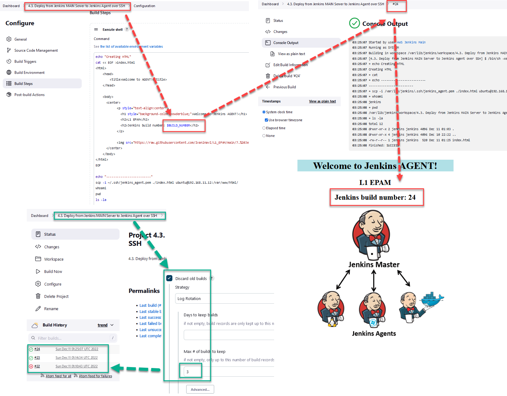
</p>

## 5. Deploy from Git over SSH
<p align="center">
  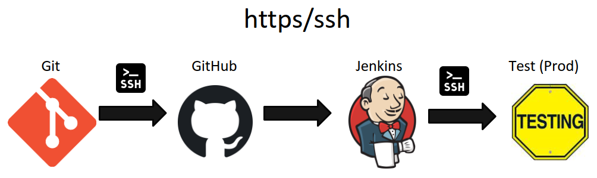
</p>

Create new repository on GitHub and add it to Jenkins.  
But it will throw an error:
<p align="center">
  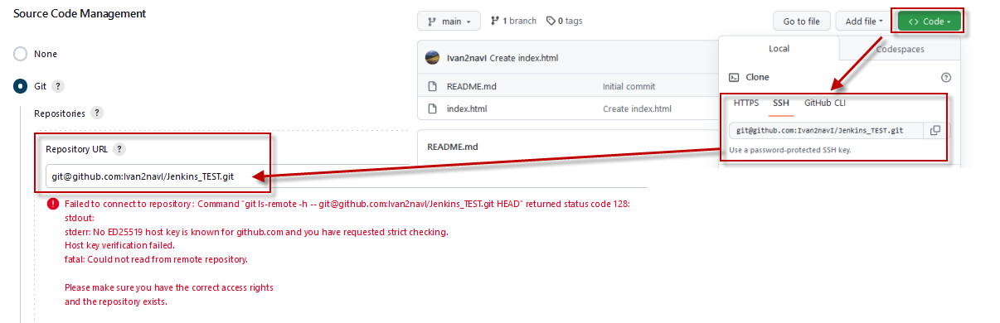
</p>

[Open Jenkins MAIN Server terminal login under Jenkins](https://stackoverflow.com/questions/15174194/jenkins-host-key-verification-failed):  
`sudo su jenkins`  
In directory `.ssh` generate public private key:
```console
jenkins@ip-192-168-11-11:~/.ssh$ ssh-keygen
# Generating public/private rsa key pair.
# Enter file in which to save the key (/var/lib/jenkins/.ssh/id_rsa): L1_Epam_jenkins2
# Enter passphrase (empty for no passphrase):
# Enter same passphrase again:
# Your identification has been saved in L1_Epam_jenkins2
# Your public key has been saved in L1_Epam_jenkins2.pub
```
Add public key to GitHub repository:
<p align="center">
  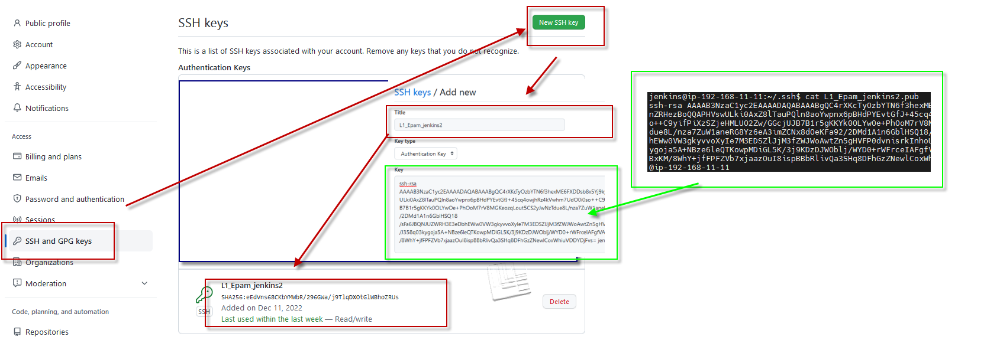
</p>

Add credentials (Username, ID + Description, Private Key) to project.
Don't forget check or change [Branches to build]:  
<p align="center">
  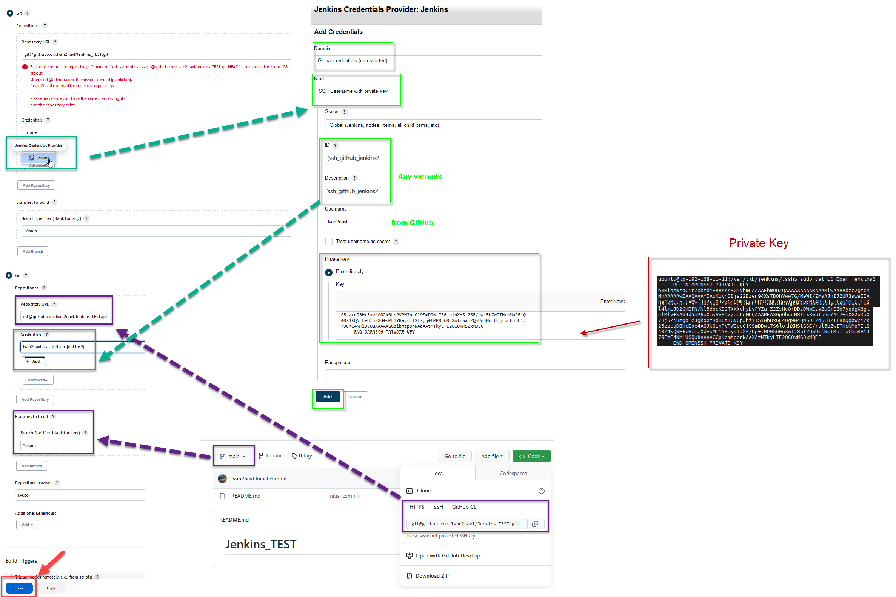
</p>

For project testing, create on GitHub `index.html` with this code: 
```html
<html>
    <head>
        <title>Welcome to AGENT!</title>
    </head>
        
    <body>
      <center>
            <p style="text-align:center">
              <h1 style="background-color:powderblue;">Welcome to Jenkins AGENT!</h1>
              <h2>L1 EPAM</h2>
              <h2>Jenkins_TEST from GitHub </h2>
            </p>

            
      </center>
    </body>
</html>
```

Then add **[Poll SCM Trigger]** with the such **[Schedule]**:`H/2 * * * *`, after that new commit to GitHub repository, waiting 2 minutes and check results on Jenkins Agent [192.168.11.12].
<p align="center">
  
</p>

## 6. Jenkins nodes (agent)
<p align="center">
  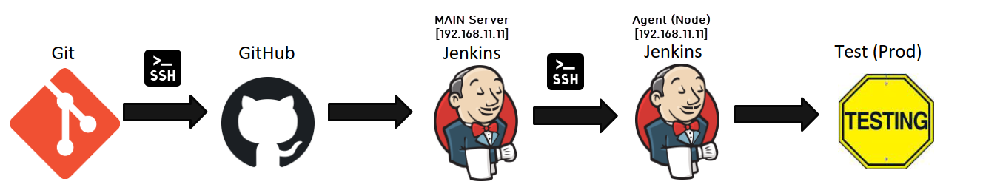
</p>

Use SSH for connecting to Jenkins Agent [192.168.11.12] and check java verion there:
```console
ubuntu@ip-192-168-11-12:~$ java --version
# Command 'java' not found, but can be installed with:
# sudo apt install default-jre              # version 2:1.11-72build2, or
# sudo apt install openjdk-11-jre-headless  # version 11.0.17+8-1ubuntu2~22.04
# sudo apt install openjdk-17-jre-headless  # version 17.0.5+8-2ubuntu1~22.04

sudo apt update && sudo apt upgrade -y

sudo apt-get install openjdk-17-jdk -y

java --version
```
Create a directory on Agent: `ubuntu@ip-192-168-11-12:~$ mkdir /home/ubuntu/jenkins`  
Than come back to MAIN Server [192.168.11.11] and get private ssh key, which used for connect to Jenkins Agent [192.168.11.12]:  
`/var/lib/jenkins/.ssh$ sudo cat jenkins_agent`

Jenkins Node Agent is quite easy to configure, we only need to insert the Jenkins workspace directory and the agent’ ip asking to connect with it by using the credentials:
<p align="center">
  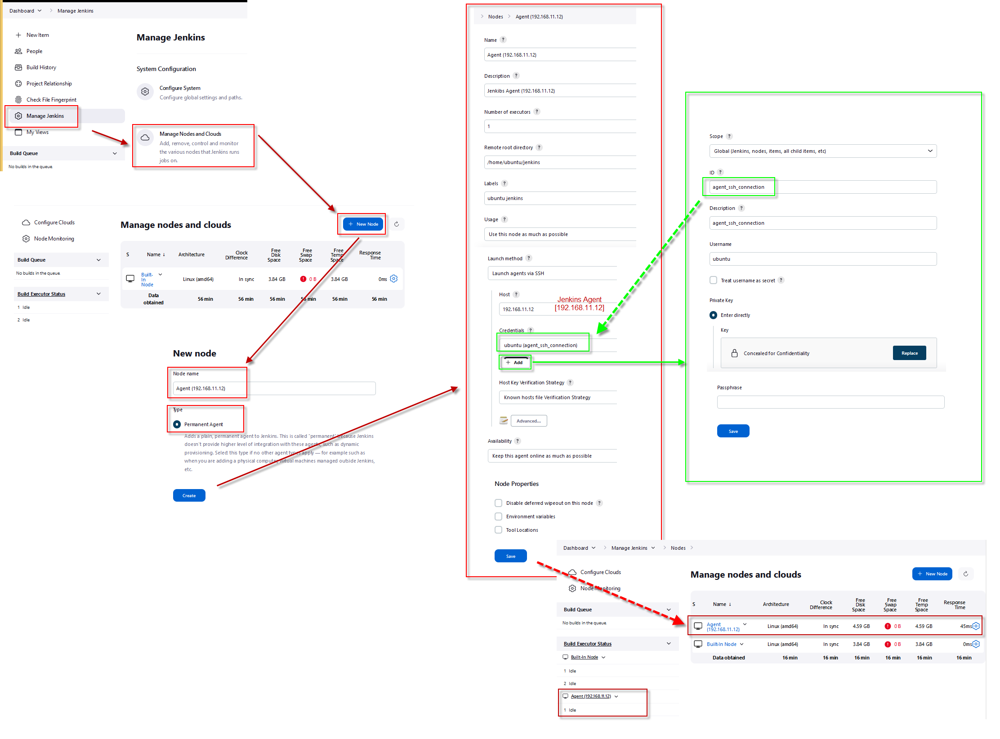
</p>

#### Create project *6. Jenkins nodes (agent)* and launch job:
<p align="center">
  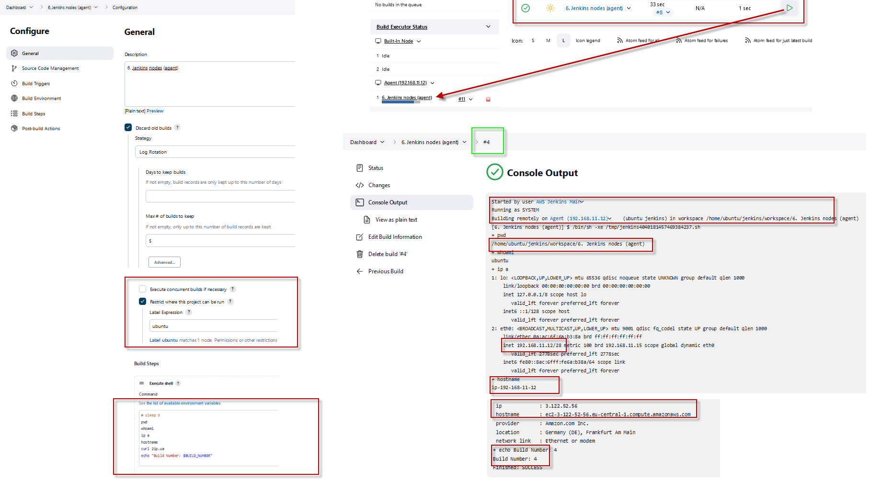
</p>

#### Create project *6v2. Jenkins nodes (agent) and GitHub* launch job:
<p align="center">
  
</p>

#### Create project *6v3. Jenkins nodes (agent) and GitHub* GitHook

P.S.: [Another way to connect Master with Slave is using JNLP(JAVA NETWORK LAUNCH PROTOCOL) protocol which makes allow the communication between two nodes.](https://techannotation.wordpress.com/2021/06/29/scale-up-jenkins-with-slave-nodes/)

## 7. CLI (command-line interface tool)
To get started, download jenkins-cli.jar, and run it as follows:

```console
ubuntu@ubuntu-VirtualBox:~$ wget http://192.168.11.11:8080/jnlpJars/jenkins-cli.jar
# --2022-12-12 01:30:28--  http://192.168.11.11:8080/jnlpJars/jenkins-cli.jar
# Connecting to 192.168.11.11:8080... connected.
# HTTP request sent, awaiting response... 200 OK
# Length: 3438037 (3,3M) [application/java-archive]
# Saving to: ‘jenkins-cli.jar’

# jenkins-cli.jar         100%[==============================>]   3,28M  --.-KB/s    in 0,03s

# 2022-12-12 01:30:28 (112 MB/s) - ‘jenkins-cli.jar’ saved [3438037/3438037]

ubuntu@ubuntu-VirtualBox:~$ java -jar jenkins-cli.jar -auth username:password -s http://192.168.11.11:8080 who-am-i
```
Create a new user: `CLI_Test_User` and check CLI connection:
```console
ubuntu@ubuntu-VirtualBox:~$ java -jar jenkins-cli.jar -auth CLI_Test_User:11fa6c8a570b2b719fc3b09b463423b06d -s http://192.168.11.11:8080 who-am-i
# Authenticated as: CLI_Test_User
# Authorities:
  # authenticated

ubuntu@ubuntu-VirtualBox:~$ java -jar jenkins-cli.jar -auth CLI_Test_User:11fa6c8a570b2b719fc3b09b463423b06d -s http://192.168.11.11:8080 who-am-i
# Authenticated as: CLI_Test_User
# Authorities:
  # authenticated
```
Then use it for login to Jenkins and create a **TOKEN**:
```console
ubuntu@ubuntu-VirtualBox:~$ export JENKINS_USER_ID=CLI_Test_User
ubuntu@ubuntu-VirtualBox:~$ export JENKINS_API_TOKEN=11fa6c8a570b2b719fc3b09b463423b06d
ubuntu@ubuntu-VirtualBox:~$ env | grep JENKINS
# JENKINS_API_TOKEN=11fa6c8a570b2b719fc3b09b463423b06d
# JENKINS_USER_ID=CLI_Test_User

ubuntu@ubuntu-VirtualBox:~$ java -jar jenkins-cli.jar -s http://192.168.11.11:8080 who-am-i                      
# Authenticated as: CLI_Test_User
# Authorities:
  # authenticated
```
<p align="center">
  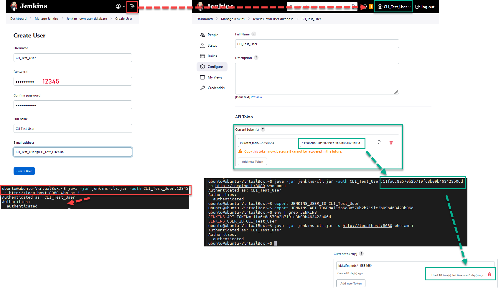
</p>

Get and Create jobs from CLI:
```console
java -jar jenkins-cli.jar -s http://192.168.11.11:8080 get-job Jobs_For_CLI > MyJOB.xml

java -jar jenkins-cli.jar -s http://192.168.11.11:8080 create-job Jobs_from_VM_CLI < MyJOB_CLI.xml
```
<p align="center">
  
</p>


#### 8. Pipeline
Create Pipeline with Trigger builds remotely:  
http://192.168.11.11:8080/job/Pipeline_TEST/build?token=Pipeline_TEST
```console
pipeline {
		agent any
			stages {
				stage('Build') {
					steps {
						echo 'Building..'
					}
				}
				stage('Test') {
					steps {
						echo 'Testing..'
					}
				}
				stage('Deploy') {
					steps {
						echo 'Deploying....'
					}
				}
			}
		}
```
<p align="center">
  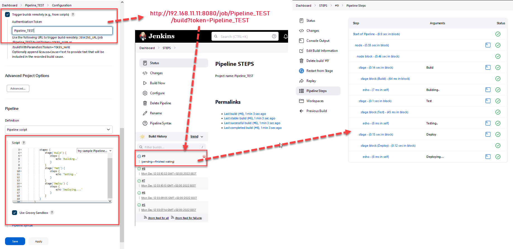
</p>


---
### PS: [Paste to Markdown](https://euangoddard.github.io/clipboard2markdown/)

Instructions

    Find the text to convert to Markdown (e.g., in another browser tab)
    Copy it to the clipboard (Ctrl+C, or ⌘+C on Mac)
    Paste it into this window (Ctrl+V, or ⌘+V on Mac)
    The converted Markdown will appear!

The conversion is carried out by [to-markdown](https://github.com/domchristie/to-markdown), a Markdown converter written in JavaScript and running locally in the browser.
