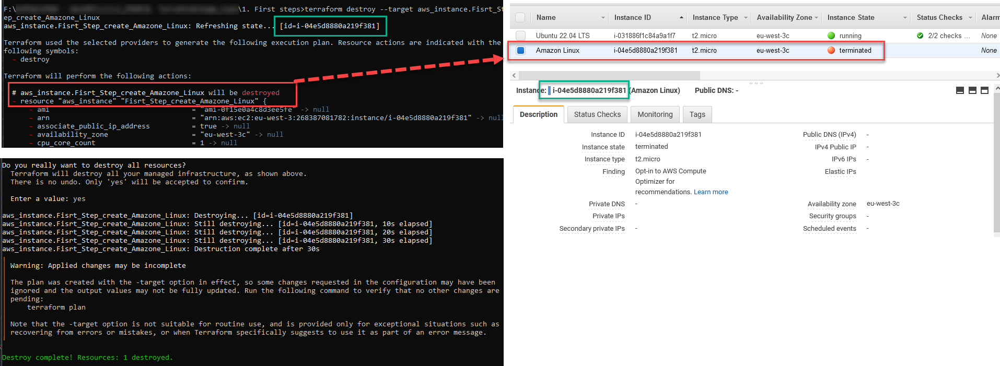

# 8. Terraform

## 1. AWS Credentials Setup & Installation on Linux/Windows

### 1.1. Follow this steps to setup AWS Credentials:
<p align="center">
  
</p>

Copy to secret place your access keys, :warning: pay attention to the fact AWS_SECRET_ACCESS_KEY_ID is displayed once :warning:.

Using environment variables to contain your credentials prevents you from accidentally sharing your AWS secret access key. We recommend that you never add your AWS access keys directly to the client in any production files. Many developers have had their account compromised by leaked keys.

To authenticate to Amazon Web Services, the SDK first checks for credentials in your environment variables. The SDK uses the getenv() function to look for the AWS_ACCESS_KEY_ID, AWS_SECRET_ACCESS_KEY, and AWS_SESSION_TOKEN environment variables. These credentials are referred to as environment credentials.


```console
# Set credentials on:
# => Linux
export AWS_ACCESS_KEY_ID="AKIAT4***************************"
export AWS_SECRET_ACCESS_KEY_ID="dSdj**********************"

## Region Europe (Frankfurt) eu-central-1
export AWS_DEFAULT_REGION="eu-central-1"

# --------------------------------------------------------
# => Windows:

C:\> SET  AWS_ACCESS_KEY_ID=AKIAT4***********************
   # The access key for your AWS account.
C:\> SET  AWS_SECRET_ACCESS_KEY=dSdj*********************
   # The secret access key for your AWS account.

## Region Europe (Frankfurt) eu-central-1
C:\> SET  AWS_DEFAULT_REGION=eu-central-1
```

### 1.2. Installing on Linux/Windows
Use this [link](https://developer.hashicorp.com/terraform/downloads) to select your actual OS.  

In my case for **Linux (Ubuntu)**, [this installation option worked](https://developer.hashicorp.com/terraform/tutorials/aws-get-started/install-cli).  
Check results:
```console
terraform --version
#   Terraform v1.3.6
#   on linux_amd64
```
There are two installation options for Windows:
First option => Download archive, unpack `teterraform.exe` to `C:\Windows\System32` and check `C:\Windows\System32` in Command Prompt.
<p align="center">
  
</p>
Second option => Download archive, unpack `teterraform.exe` for example `C:\Terraform`.  
Use `Win+R` and `sysdm.cpl` to add new eviroment variable:
<p align="center">
  
</p>

## 2. Terraform. First steps.
For testing I will use region Europe (Paris): `eu-west-3`  

In Windows Command Prompt set credentials:
```console
C:\> SET  AWS_ACCESS_KEY_ID=AKIAT4***********************
   # The access key for your AWS account.
C:\> SET  AWS_SECRET_ACCESS_KEY=dSdj*********************
   # The secret access key for your AWS account.
```

### 2.1. Create  project folder and `.tf` file there: *Create_aws_ec2.tf*.
```console
# Select cloud provider: AWS
provider "aws" {
    region = "eu-west-3"
}

# Amazon Linux 2 Kernel 5.10 AMI 2.0.20221103.3 x86_64 HVM gp2: 
# ami-0f15e0a4c8d3ee5fe
# -------------------------------------------------------------
# Virtual server type (instance type)
# t2.micro

resource "aws_instance" "Fisrt_Step_create_Amazone_Linux" {
    ami           = "ami-0f15e0a4c8d3ee5fe"
    instance_type = "t2.micro"

    tags = {
        Name = "Amazon Linux"
        Owner = "DevOps Student"
        Project = "Terraform (L1 EPAM)"
    }
}

```
:warning: Add exception to .gitingnore file: :warning: 
```console
\8. Terraform\home_task* 
!8. Terraform\home_task\1. First steps\Create_aws_ec2.tf
```

Run in this folder [Winows Command Prompt] with command: `terraform init`.  
Then wait for dowloading (AWS) provider plugins (~400Mb).  
<p align="center">
  
</p>

Next, command: `terraform plan`.  
If configuration of EC2 instances correct, enter: `terraform apply`  
<p align="center">
  
</p>

Add one more EC2 & check results:  
```console
# Canonical, Ubuntu, 22.04 LTS, amd64 jammy image build on 2022-12-01: 
# ami-03b755af568109dc3
# -------------------------------------------------------------
# Virtual server type (instance type)
# t2.micro

resource "aws_instance" "Fisrt_Step_create_Ubuntu_2204" {
    ami           = "ami-0f15e0a4c8d3ee5fe"
    instance_type = "t2.micro"

    tags = {
        Name = "Ubuntu 22.04 LTS"
        Owner = "DevOps Student"
        Project = "Terraform (L1 EPAM)"
    }
}
```
<p align="center">
  
</p>

Now delete one of instances: `terraform destroy --target aws_instance.Fisrt_Step_create_Amazone_Linux`  
or cut/comment code one of them from `.tf` file.  
<p align="center">
  
</p>

Delete all instances: `terraform destroy`  
<p align="center">
  
</p>

### 2.2. Use Count for create and destroy EC2.
Add paramentr `count = 2` to add 2 (or more) identical EC2's:
```console
# Select cloud provider: AWS
provider "aws" {
    region = "eu-west-3"
}

# Amazon Linux 2 Kernel 5.10 AMI 2.0.20221103.3 x86_64 HVM gp2: 
# ami-0f15e0a4c8d3ee5fe
# -------------------------------------------------------------
# Virtual server type (instance type)
# t2.micro

resource "aws_instance" "Fisrt_Step_create_Amazone_Linux" {
    count         = 2                                           # to add 2 (or more) identical EC2's                      
    ami           = "ami-0f15e0a4c8d3ee5fe"
    instance_type = "t2.micro"

    tags = {
        Name = "Amazon Linux"
        Owner = "DevOps Student"
        Project = "Terraform (L1 EPAM)"
    }
}
```
Next, command: `terraform plan`.  
If configuration of EC2 instances correct, enter: `terraform apply`

If you want delete one of instances, you can change `count=1`,  
if change `count=0` - that delete all instances.  
But, you can also use: `terraform destroy`.


https://spacelift.io/blog/how-to-destroy-terraform-resources
Step 3 – Destroy Protected Resources
Step 4 – Destroy All Except a Few