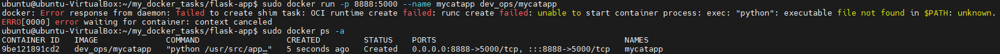

# 9. Docker :whale:

## 1. [Install Docker Engine on Ubuntu](https://docs.docker.com/engine/install/ubuntu/)

### 1.1. Before you install Docker Engine for the first time on a new host machine, you need to [set up the Docker repository](https://docs.docker.com/engine/install/ubuntu/). Afterward, you can install and update Docker from the repository.
```console
sudo docker run hello-world
> Unable to find image 'hello-world:latest' locally
> latest: Pulling from library/hello-world
> 2db29710123e: Pull complete
> Digest: sha256:c77be1d3a47d0caf71a82dd893ee61ce01f32fc758031a6ec4cf1389248bb833
> Status: Downloaded newer image for hello-world:latest

> Hello from Docker!
> This message shows that your installation appears to be working correctly.

# !!!!!!!!!!!!!!!!!!!!!!!!!!!!!!!!!!!!!!!!!!!!!!!!!!!!!!!!!!!!!!!!!!!!!!!!!!!!!!!!!!
docker -v
> Docker version 20.10.21, build baeda1f
# !!!!!!!!!!!!!!!!!!!!!!!!!!!!!!!!!!!!!!!!!!!!!!!!!!!!!!!!!!!!!!!!!!!!!!!!!!!!!!!!!!
uname -a
> Linux ubuntu-VirtualBox 5.15.0-52-generic #58-Ubuntu SMP Thu Oct 13 08:03:55 UTC 2022 x86_64 x86_64 x86_64 GNU/Linux
# !!!!!!!!!!!!!!!!!!!!!!!!!!!!!!!!!!!!!!!!!!!!!!!!!!!!!!!!!!!!!!!!!!!!!!!!!!!!!!!!!!
cat /etc/os-release
> PRETTY_NAME="Ubuntu 22.04.1 LTS"
> NAME="Ubuntu"
> VERSION_ID="22.04"
> VERSION="22.04.1 LTS (Jammy Jellyfish)"
> VERSION_CODENAME=jammy
```
If you would like to use Docker as a non-root user, you should now consider adding your user to the
“docker” group with something like:  
`sudo usermod -aG docker ubuntu`  
  
Purging All Unused or Dangling Images, Containers, Volumes, and Networks Docker provides a single command that will clean up any resources — images, containers, volumes, and
networks — that are dangling (not associated with a container):
`docker system prune`  
  
To additionally remove any stopped containers and all unused images (not just dangling images), add the -a flag to the command:  
`docker system prune -a`  

### 1.2. Create directory for Docker file(-s) and dive into it.
TASK :a: :
```console
# Create directory for Dockerfile(-s) and and dive into it.
mkdir dockerfiles
cd dockerfiles

# Edit it and add the commands with nano:
nano Dockerfile
# !!!!!!!!!!!!!!!!!!!!!!!!!!!!!!!!!!!!!!!!!!!!!!!!!!!!!!!!!!!!!!!!!!!!!!!!!!!!!!!!!!
FROM ubuntu:20.04

ENV TZ=China/Bejin
RUN apt-get -y update
RUN DEBIAN_FRONTEND="noninteractive" \
apt-get -y install apache2
RUN echo 'Hi there, what is love?' > /var/www/html/index.html
RUN echo 'It is just a song ...' >> /var/www/html/index.html

CMD ["/usr/sbin/apache2ctl", "-DFOREGROUND"]

EXPOSE 80
# !!!!!!!!!!!!!!!!!!!!!!!!!!!!!!!!!!!!!!!!!!!!!!!!!!!!!!!!!!!!!!!!!!!!!!!!!!!!!!!!!!

# Finally build it:
# docker build -t <tag> .
sudo docker build -t dev_ops:v1 .

sudo docker images

sudo docker run -d -p 9998:80 dev_ops:v1

# !!!!!!!!!!!!!!!!!!!!!!!!!!!!!!!!!!!!!!!!!!!!!!!!!!!!!!!!!!!!!!!!!!!!!!!!!!!!!!!!!!
sudo docker ps -a
```
<p align="left">
  
</p>


TASK :b: :
```console
# Edit it and add the commands with nano:
nano Dockerfile
# !!!!!!!!!!!!!!!!!!!!!!!!!!!!!!!!!!!!!!!!!!!!!!!!!!!!!!!!!!!!!!!!!!!!!!!!!!!!!!!!!!
FROM centos:7

RUN yum -y update
RUN yum -y install httpd
RUN echo 'TASK B: FROM centos:7' > /var/www/html/index.html
CMD ["/usr/sbin/httpd", "-DFOREGROUND"]

EXPOSE 80
# !!!!!!!!!!!!!!!!!!!!!!!!!!!!!!!!!!!!!!!!!!!!!!!!!!!!!!!!!!!!!!!!!!!!!!!!!!!!!!!!!!

# Finally build it:
# docker build -t <tag> .
sudo docker build -t dev_ops:v2 .

sudo docker images

sudo docker run -d -p 9988:80 dev_ops:v2
```
<p align="left">
  
</p>

### 1.3. Frequently used Docker commands
```console
# To delete all containers including its volumes use,
docker rm -vf $(docker ps -aq)

# To delete all the images,
docker rmi -f $(docker images -aq)

# Show docker disk usage
docker system df
docker system df -v

# Remove unused data
docker system prune
--all , -a 		  Remove all unused images not just dangling ones
--filter 		    API 1.28+ Provide filter values (e.g. ‘label==')
--force , -f 		Do not prompt for confirmation
--volumes 		  Prune volumes
```
Docker Command                      | Task
----------------------------------- | ---------------------------------------------------
docker ps [-a]                      | list
docker stop $(docker ps -a -q)      | stop all containers [you need stop before delete]
docker rm 0fd99ee0cb61              | remove a single container
docker images -a                    | list
docker rmi $(docker images -a -q)   | remove all images
docker search tomcat                |
docker pull tomcat                  |
docker search nginx                 |
docker pull nginx                   |
docker run -it -p 8889:8080 tomcat  |
docker run -it -p 8888:80 nginx     |
docker run -d -p 8890:80 nginx      |
----------------------------------- | ---------------------------------------------------
docker run                          | Runs a command in a new container.
docker start                        | Starts one or more stopped containers
docker stop                         | Stops one or more running containers
docker build                        | Builds an image from a Docker file
docker pull                         | Pulls an image or a repository from a registry
docker push                         | Pushes an image or a repository to a registry
docker export                       | Exports a container’s filesystem as a tar archive
docker exec                         | Runs a command in a run-time container
docker search                       | Searches the Docker Hub for images
docker attach                       | Attaches to a running container
docker commit                       | Creates a new image from a container’s changes


### 1.4. :hammer: Optimizing Docker (OPTION) :hammer:
:pushpin: [You can skip this step](https://devdotnet.org/post/ustanovka-docker-dlya-arm-i-64-bit-arm-armbian-linux/). :pushpin:  
While running, the container can be very active in writing data to the event log, and the size of the log file will only increase. Therefore, it is necessary to limit the size and number of log files created by creating the  `/etc/docker/daemon.json`  file .  
To publish ports outside the container, Docker creates a separate TCP or UDP proxy for each port. If there are a lot of ports, then this reduces the network exchange speed and loads the processor more. To disable userland-proxy, you need to make changes to the  `/etc/docker/daemon.json`  file .  
  
Open/create  `nano /etc/docker/daemon.json`  file:
```console
{
    "log-driver": "local" , 
    "log-opts": { 
        "max-size": "10m" , 
        "maxfile": "3"
    } ,
    "userland-proxy": false 
}
```
Description of parameters:  
    - **"log-driver": "local"** - options for local log files  
    - **"max-size": "10m"** - the maximum size of one log file is 10 MB  
    - **"max-file": "3"** - the maximum number of log files is 3
    
Restart the Docker service for the new settings to take effect:  
`sudo systemctl restart docker`

## 2. Webapps with Docker
### 2.1. Create a Python Flask app that displays random cat pix
The goal of this exercise is to create a Docker image which will run a Flask app.  
We'll do this by first pulling together the components for a random cat picture generator built with Python Flask, then dockerizing it by writing a Dockerfile.  
Finally, we'll build the image, and then run it.  
Create a Python Flask app that displays random cat pix  
➢ Write a Dockerfile  
➢ Build the image  
➢ Run your image  
➢ Push your image to the Docker registry  

Prepairing all needed files:
<p align="center">
  
</p>

Docker image building:
```console
docker build -t dev_ops/mycatapp .

docker run -p 8888:5000 --name mycatapp dev_ops/mycatapp
```
<p align="center">
  
</p>

**But since this was not the only one problem, I decided to update the versions of all programs, and also find and update the link to the `gif` files with cats.**    
**Final result:**
```console
docker build -t dev_ops/mycatapp .

docker run -p 8888:5000 --name mycatapp dev_ops/mycatapp
```
<p align="center">
  
</p>

**All updated files are [here](https://github.com/Ivan2navI/L1_EPAM/tree/main/9.%20Docker/flask-app):**
<p align="center">
  
</p>

### 2.2. Create an account in Docker Hub
Pushing to docker registry:
```console 
docker login
> Username: risabyxo
> Password:
> Login Succeeded

# docker tag image_name YOUR_DOCKERHUB_NAME/image_name
docker tag dev_ops/mycatapp risabyxo/mycatapp

# docker push YOUR_DOCKERHUB_NAME/image_name
docker push risabyxo/mycatapp

# To push a new tag to this repository,
docker push risabyxo/mycatapp:tagname
```
<p align="center">
  
</p>

Pull Docker Image from Docker Hub and Run it:
```console
# Verify Docker version and also login to Docker Hub
docker version
docker login

# Pull Image from Docker Hub 
docker pull risabyxo/mycatapp:latest

# Run the downloaded Docker Image & Access the Application
docker run --name my_app_from_DockerHub -p 80:5000 -d risabyxo/mycatapp:latest
# !!! OR !!!
docker run -p 80:5000 --name my_app_from_DockerHub risabyxo/mycatapp:latest

# Connect to Container Terminal
docker exec -it <container-name> /bin/sh

# Container Stop, Start
docker stop <container-name>
docker start  <container-name>
```
<p align="center">
  
</p>

## 3. Docker Compose
You can use Docker Compose to easily run WordPress in an isolated environment built with Docker containers.  
### 3.1. Install Docker Compose

To make sure you obtain the most updated stable version of Docker Compose, you'll download this software from its [official Github repository](https://github.com/docker/compose).  
First, confirm the latest version available in their [releases page](https://github.com/docker/compose/releases).  
At the time of [this writing](https://www.digitalocean.com/community/tutorials/how-to-install-and-use-docker-compose-on-ubuntu-22-04), the most current stable version is `v2.14.1`.  
Use the following command to download:
```console
sudo curl -SL "https://github.com/docker/compose/releases/download/v2.14.1/docker-compose-$(uname -s)-$(uname -m)" -o /usr/local/bin/docker-compose
```
Next, set the correct permissions so that the docker compose command is executable:   
`sudo chmod +x /usr/local/bin/docker-compose`
To verify that the installation was successful, you can run:  
`docker compose version`  

### 3.2. WordPress with MySQL:
This example defines one of the basic setups for WordPress. More details on how this works can be found on the official [WordPress image page](https://hub.docker.com/_/wordpress).  

Create a `my_wordpress` project directory and then change into.
Create a `docker-compose.yml` file that starts your WordPress blog and a separate MySQL instance with a volume mount for data persistence:
```console
version: '3.7'
services:
  db:
    # We use a mariadb image which supports both amd64 & arm64 architecture
    # image: mariadb:10.6.4-focal
    # If you really want to use MySQL, uncomment the following line
    image: mysql:8.0.27
    # command: '--default-authentication-plugin=mysql_native_password'
    volumes:
      - db_data:/var/lib/mysql
    restart: always
    environment:
      - MYSQL_ROOT_PASSWORD=somewordpress
      - MYSQL_DATABASE=wordpress
      - MYSQL_USER=wordpress
      - MYSQL_PASSWORD=wordpress
    expose:
      - 3306
      - 33060
  wordpress:
    image: wordpress:latest
    ports:
      - 8000:80
    restart: always
    environment:
      - WORDPRESS_DB_HOST=db
      - WORDPRESS_DB_USER=wordpress
      - WORDPRESS_DB_PASSWORD=wordpress
      - WORDPRESS_DB_NAME=wordpress
volumes:
  db_data:
```
With the `docker-compose.yml` file in place, you can now execute Docker Compose to bring your environment up. The following command will download the necessary Docker images, create a container for the web service, and run the containerized environment in background mode: 
`docker-compose up -d`

<p align="center">
  
</p>

:triangular_flag_on_post: **Experiment with some other commands** :triangular_flag_on_post:  
If you want to run your services in the background, you can pass the `-d` flag (for "detached" mode) to `docker compose up`   
and use `docker compose ps` to see what is currently running.  

If you started Compose with `docker compose up -d`, stop your services once you've finished with them:
```
docker compose stop
```
You can bring everything down, removing the containers entirely, with the `down` command. Pass `--volumes` to also remove the data volume used by the Redis container:
```
 docker compose down --volumes
```

### 3.3. Docker Compose. Use volumes.
You can create and manage volumes outside the scope of any container.
```console
# Create a volume:
docker volume create my-vol

# List volumes:
docker volume ls

# Inspect a volume:
docker volume inspect my-vol

# Remove a volume:
docker volume rm my-vol
```
<p align="center">
  
</p>


