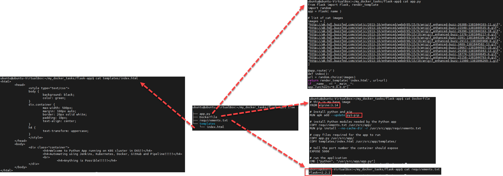

# 9. Docker :whale:

## 1. [Install Docker Engine on Ubuntu](https://docs.docker.com/engine/install/ubuntu/)

### 1.1. Before you install Docker Engine for the first time on a new host machine, you need to [set up the Docker repository](https://docs.docker.com/engine/install/ubuntu/). Afterward, you can install and update Docker from the repository.
```console
sudo docker run hello-world
> Unable to find image 'hello-world:latest' locally
> latest: Pulling from library/hello-world
> 2db29710123e: Pull complete
> Digest: sha256:c77be1d3a47d0caf71a82dd893ee61ce01f32fc758031a6ec4cf1389248bb833
> Status: Downloaded newer image for hello-world:latest

> Hello from Docker!
> This message shows that your installation appears to be working correctly.

# !!!!!!!!!!!!!!!!!!!!!!!!!!!!!!!!!!!!!!!!!!!!!!!!!!!!!!!!!!!!!!!!!!!!!!!!!!!!!!!!!!
docker -v
> Docker version 20.10.21, build baeda1f
# !!!!!!!!!!!!!!!!!!!!!!!!!!!!!!!!!!!!!!!!!!!!!!!!!!!!!!!!!!!!!!!!!!!!!!!!!!!!!!!!!!
uname -a
> Linux ubuntu-VirtualBox 5.15.0-52-generic #58-Ubuntu SMP Thu Oct 13 08:03:55 UTC 2022 x86_64 x86_64 x86_64 GNU/Linux
# !!!!!!!!!!!!!!!!!!!!!!!!!!!!!!!!!!!!!!!!!!!!!!!!!!!!!!!!!!!!!!!!!!!!!!!!!!!!!!!!!!
cat /etc/os-release
> PRETTY_NAME="Ubuntu 22.04.1 LTS"
> NAME="Ubuntu"
> VERSION_ID="22.04"
> VERSION="22.04.1 LTS (Jammy Jellyfish)"
> VERSION_CODENAME=jammy
```
If you would like to use Docker as a non-root user, you should now consider adding your user to the
“docker” group with something like:  
`sudo usermod -aG docker ubuntu`  
  
Purging All Unused or Dangling Images, Containers, Volumes, and Networks Docker provides a single command that will clean up any resources — images, containers, volumes, and
networks — that are dangling (not associated with a container):
`docker system prune`  
  
To additionally remove any stopped containers and all unused images (not just dangling images), add the -a flag to the command:  
`docker system prune -a`  

### 1.2. Create directory for Docker file(-s) and dive into it.
TASK :a: :
```console
# Create directory for Dockerfile(-s) and and dive into it.
mkdir dockerfiles
cd dockerfiles

# Edit it and add the commands with nano:
nano Dockerfile
# !!!!!!!!!!!!!!!!!!!!!!!!!!!!!!!!!!!!!!!!!!!!!!!!!!!!!!!!!!!!!!!!!!!!!!!!!!!!!!!!!!
FROM ubuntu:20.04

ENV TZ=China/Bejin
RUN apt-get -y update
RUN DEBIAN_FRONTEND="noninteractive" \
apt-get -y install apache2
RUN echo 'Hi there, what is love?' > /var/www/html/index.html
RUN echo 'It is just a song ...' >> /var/www/html/index.html

CMD ["/usr/sbin/apache2ctl", "-DFOREGROUND"]

EXPOSE 80
# !!!!!!!!!!!!!!!!!!!!!!!!!!!!!!!!!!!!!!!!!!!!!!!!!!!!!!!!!!!!!!!!!!!!!!!!!!!!!!!!!!

# Finally build it:
# docker build -t <tag> .
sudo docker build -t dev_ops:v1 .

sudo docker images

sudo docker run -d -p 9998:80 dev_ops:v1

# !!!!!!!!!!!!!!!!!!!!!!!!!!!!!!!!!!!!!!!!!!!!!!!!!!!!!!!!!!!!!!!!!!!!!!!!!!!!!!!!!!
sudo docker ps -a
```
<p align="left">
  
</p>


TASK :b: :
```console
# Edit it and add the commands with nano:
nano Dockerfile
# !!!!!!!!!!!!!!!!!!!!!!!!!!!!!!!!!!!!!!!!!!!!!!!!!!!!!!!!!!!!!!!!!!!!!!!!!!!!!!!!!!
FROM centos:7

RUN yum -y update
RUN yum -y install httpd
RUN echo 'TASK B: FROM centos:7' > /var/www/html/index.html
CMD ["/usr/sbin/httpd", "-DFOREGROUND"]

EXPOSE 80
# !!!!!!!!!!!!!!!!!!!!!!!!!!!!!!!!!!!!!!!!!!!!!!!!!!!!!!!!!!!!!!!!!!!!!!!!!!!!!!!!!!

# Finally build it:
# docker build -t <tag> .
sudo docker build -t dev_ops:v2 .

sudo docker images

sudo docker run -d -p 9988:80 dev_ops:v2
```
<p align="left">
  
</p>

### 1.3. Frequently used Docker commands
```console
# To delete all containers including its volumes use,
docker rm -vf $(docker ps -aq)

# To delete all the images,
docker rmi -f $(docker images -aq)

# Show docker disk usage
docker system df
docker system df -v

# Remove unused data
docker system prune
--all , -a 		  Remove all unused images not just dangling ones
--filter 		    API 1.28+ Provide filter values (e.g. ‘label==')
--force , -f 		Do not prompt for confirmation
--volumes 		  Prune volumes
```
Docker Command                      | Task
----------------------------------- | ---------------------------------------------------
docker ps [-a]                      | list
docker stop $(docker ps -a -q)      | stop all containers [you need stop before delete]
docker rm 0fd99ee0cb61              | remove a single container
docker images -a                    | list
docker rmi $(docker images -a -q)   | remove all images
docker search tomcat                |
docker pull tomcat                  |
docker search nginx                 |
docker pull nginx                   |
docker run -it -p 8889:8080 tomcat  |
docker run -it -p 8888:80 nginx     |
docker run -d -p 8890:80 nginx      |
----------------------------------- | ---------------------------------------------------
docker run                          | Runs a command in a new container.
docker start                        | Starts one or more stopped containers
docker stop                         | Stops one or more running containers
docker build                        | Builds an image from a Docker file
docker pull                         | Pulls an image or a repository from a registry
docker push                         | Pushes an image or a repository to a registry
docker export                       | Exports a container’s filesystem as a tar archive
docker exec                         | Runs a command in a run-time container
docker search                       | Searches the Docker Hub for images
docker attach                       | Attaches to a running container
docker commit                       | Creates a new image from a container’s changes


### 1.4. :hammer: Optimizing Docker (OPTION) :hammer:
:pushpin: [You can skip this step](https://devdotnet.org/post/ustanovka-docker-dlya-arm-i-64-bit-arm-armbian-linux/). :pushpin:  
While running, the container can be very active in writing data to the event log, and the size of the log file will only increase. Therefore, it is necessary to limit the size and number of log files created by creating the  `/etc/docker/daemon.json`  file .  
To publish ports outside the container, Docker creates a separate TCP or UDP proxy for each port. If there are a lot of ports, then this reduces the network exchange speed and loads the processor more. To disable userland-proxy, you need to make changes to the  `/etc/docker/daemon.json`  file .  
  
Open/create  `nano /etc/docker/daemon.json`  file:
```console
{
    "log-driver": "local" , 
    "log-opts": { 
        "max-size": "10m" , 
        "maxfile": "3"
    } ,
    "userland-proxy": false 
}
```
Description of parameters:  
    - **"log-driver": "local"** - options for local log files  
    - **"max-size": "10m"** - the maximum size of one log file is 10 MB  
    - **"max-file": "3"** - the maximum number of log files is 3
    
Restart the Docker service for the new settings to take effect:  
`sudo systemctl restart docker`

## 2. Webapps with Docker

The goal of this exercise is to create a Docker image which will run a Flask app.  
We'll do this by first pulling together the components for a random cat picture generator built with Python Flask, then dockerizing it by writing a Dockerfile.  
Finally, we'll build the image, and then run it.  
Create a Python Flask app that displays random cat pix  
➢ Write a Dockerfile  
➢ Build the image  
➢ Run your image  
➢ Push your image to the Docker registry  

Prepairing all needed files:
<p align="center">
  
</p>

Docker image building:
<p align="center">
  
</p>

```console
docker build -t dev_ops/mycatapp .

docker run -p 8888:5000 --name mycatapp dev_ops/mycatapp

```
---
<p align="center">
  
</p>

---

- **2 spaces** – for indentation
- **No unused variables** – this one catches tons of bugs!
- **No semicolons** – It's fine. Really!
- Never start a line with `(` , `[` , or `````
    - This is the only gotcha with omitting semicolons – automatically checked for you!
- **Space after keywords** `if (condition) { ... }`
- Always use `===` instead of `==` – but `obj == null` is allowed to check `null || undefined` .

---

The easiest way to use JavaScript Standard Style to check your code is to install it globally as a Node command line program. To do so, simply run the following command in your terminal (flag `-g` installs standard globally on your system, omit it if you want to install in the current working directory):

```bash
npm install standard -g
```

After you've done that you should be able to use the `standard` program. The simplest use case would be checking the style of all JavaScript files in the current working directory:

```bash
$ standard
Error: Use JavaScript Standard Style
 lib/torrent.js:950:11: Expected '===' and instead saw '=='.
```

This guide is based on [https://github.com/feross/standard](https://github.com/feross/standard)

# 2**. xxxxxxxxxxxxxxxxxxxxxxxxxxxxxxxxxxxxxxxxxxx**

---

- **2 spaces** – for indentation
- **No unused variables** – this one catches tons of bugs!
- **No semicolons** – It's fine. Really!
- Never start a line with `(` , `[` , or `````
    - This is the only gotcha with omitting semicolons – automatically checked for you!
- **Space after keywords** `if (condition) { ... }`
- Always use `===` instead of `==` – but `obj == null` is allowed to check `null || undefined` .

---

The easiest way to use JavaScript Standard Style to check your code is to install it globally as a Node command line program. To do so, simply run the following command in your terminal (flag `-g` installs standard globally on your system, omit it if you want to install in the current working directory):

```bash
npm install standard -g
```

After you've done that you should be able to use the `standard` program. The simplest use case would be checking the style of all JavaScript files in the current working directory:

```bash
$ standard
Error: Use JavaScript Standard Style
 lib/torrent.js:950:11: Expected '===' and instead saw '=='.
```
